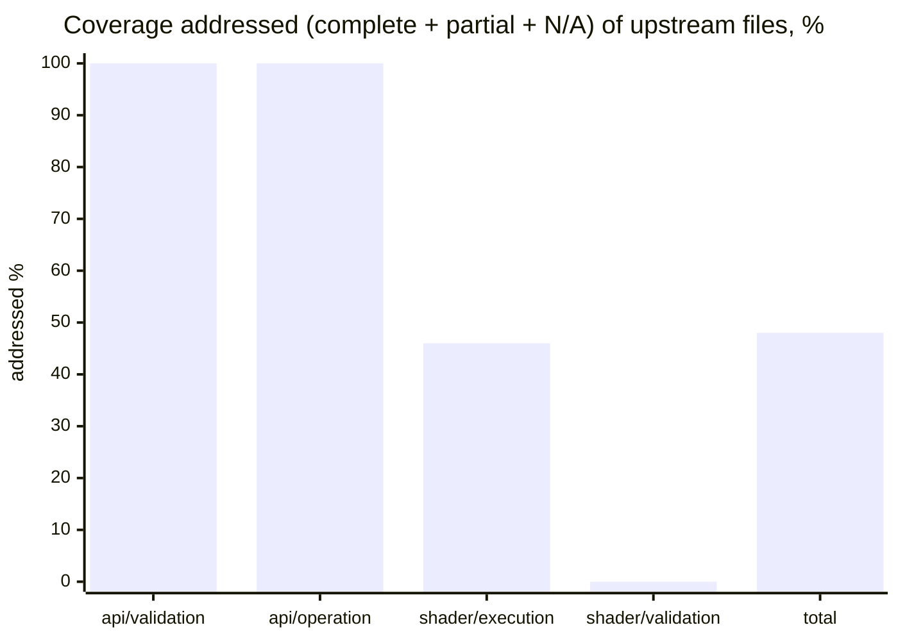

# webgpu-native-cts

A WebGPU Conformance Test Suite (CTS) written in **C++**, targeting the **WebGPU C API**
(`webgpu.h`) directly — no JavaScript engine, no language bindings.

> The *tests* are C++ that call the WebGPU **C** API. C++ is used because the upstream CTS is
> object-oriented, fluent, and closure-based; a C++ port maps to it almost 1:1, which is the
> whole point of a faithful port.

The goal is to port the upstream TypeScript [WebGPU CTS](https://github.com/gpuweb/cts)
as faithfully as practical, so that native WebGPU implementations can be checked for
conformance by linking a small native test binary instead of embedding a full JS runtime.

## Why

The canonical WebGPU CTS is written in TypeScript and runs in a browser or against native
implementations through a JS engine bound to native code:

- **wgpu** runs the CTS via Deno (`deno_webgpu` ops → `wgpu_core`).
- **Dawn** runs the CTS via Node.js NAPI bindings (`dawn_node` → `dawn::native`).

Both approaches require shipping and maintaining a JavaScript runtime and a binding layer.
This project takes a different path: the tests are written directly against the C API that
implementations such as [wgpu-native](https://github.com/gfx-rs/wgpu-native),
[yawgpu](https://github.com/infosia/yawgpu), and
[Dawn](https://dawn.googlesource.com/dawn) export, so the test binary links straight against
the implementation under test.

## Target implementations

Tests are written against the **canonical** `webgpu.h` from
[webgpu-native/webgpu-headers](https://github.com/webgpu-native/webgpu-headers), which all of the
target backends implement. The suite is **link-agnostic**: a build-time option (`CTS_BACKEND`)
selects which implementation to link against. Three backends are targeted, each playing a distinct
role in the cross-implementation comparison:

- **yawgpu** ([github.com/infosia/yawgpu](https://github.com/infosia/yawgpu)) — a from-scratch
  Rust implementation of `webgpu.h` (Metal/Vulkan backends; vendor extensions in a companion
  `yawgpu.h`). The **primary conformance subject** — the implementation this suite exists to validate.
- **Dawn** — Google's C++ reference implementation. It passes the ported suite, so it serves as the
  **conformance oracle**: the ground-truth behaviour against which any backend disagreement is judged.
- **wgpu-native** — the mature Rust implementation (`wgpu_core`); the backend the harness was first
  brought up against, and a third independent data point that keeps the comparison from being a
  two-way tie.

Implementation-specific differences (native feature enums, instance-creation extras like
yawgpu's `YaWGPUInstanceBackendSelect`) are isolated behind a thin backend shim.

## Language

- The entire suite — tests and harness — is **C++20**.
- Tests call the WebGPU **C** API (`webgpu.h`) directly; they do not depend on any C++ wrapper
  for WebGPU itself.
- The harness is a **custom C++ framework that mirrors the upstream CTS framework 1:1**
  (`MakeTestGroup` / `g.test().desc().params().fn()`, fluent parameter builders —
  `combine`/`combineWithParams`/`filter`/`expand`/`beginSubcases` with per-case subcase expansion —
  lambda test bodies, `expectValidationError([&]{ ... }, shouldError)`, the `suite:file:test:params`
  query system, and a case/subcase tree). It is **not** built on GoogleTest, Catch2, doctest, or
  Criterion — those impose a test model that conflicts with the CTS case/subcase split and
  query-string identity. The harness's own logic (params expansion, query parsing, format tables,
  expectation matching) is checked by a small self-test binary, `cts_unittests`, with no third-party
  test framework.

## Repository layout

```
webgpu-native-cts/
├── README.md  CLAUDE.md  LICENSE  CMakeLists.txt
├── docs/                  # Design docs + UPSTREAM / COVERAGE / FINDINGS
├── specs/                 # Per-slice task specs + reference/ (workflow, templates)
├── include/cts/           # Public C++ test-author API (gpu.h, test.h, webgpu.h)
├── src/
│   ├── common/            # Harness: registry, params, query, runner, runtime, webgpu/ (async→sync, backend shim)
│   ├── webgpu/            # Ported tests (.spec.cpp) + capability_info / texture_format tables + listing.json
│   └── unittests/         # Harness self-tests (cts_unittests)
├── expectations/          # Per-backend known-failure lists ({wgpu-native,yawgpu,dawn}.txt)
└── tools/gen_listings/    # Listing generator → src/webgpu/listing.json
```

The build directories (`build-*/`) are git-ignored. The canonical `webgpu.h` is **not** vendored —
each backend supplies its own `webgpu-headers/webgpu.h` (Dawn its generated header), selected by
`CTS_BACKEND` at configure time.

## Status

**Active.** The harness is complete; tests are being ported in parallel batches. All three
backends build link-agnostically and run on real GPUs — verified on **macOS / Apple Metal** and
**Windows 11 / Vulkan** (NVIDIA GeForce RTX 5060 Ti). Last full sweep: **2026-06-14** — Dawn `534184/0`,
yawgpu Metal green (`460730`, 2 Dawn-leniency now `xfail`), yawgpu MoltenVK Vulkan-path residuals,
wgpu-native bring-up. All eight Apple-masked native-Vulkan findings (F-105…F-112) resolved — seven
fixed & re-verified on NVIDIA Vulkan (2026-06-15/16), F-111 a documented external-texture `xfail`.
**Since (2026-06-18/19):** the `shader/execution` `expression/call/builtin` family advanced through five
batches — `atomics` (phaseY7), the **entire texture built-in family** (phaseY8–Y9, 15 files on a ported
`texture_utils` software-reference sampler), the P2 **synchronization + derivatives** built-ins (phaseY10:
`workgroupBarrier`/`storageBarrier`/`workgroupUniformLoad`/`arrayLength` + `dpdx`/`dpdy`/`fwidth`×coarse/fine),
the P3 **integer/bit/pack** built-ins (phaseY11: a generic `run()` expression harness + 16 integer/bit
builtins, `bitcast`, and 11 float pack/unpack), and the P3 **`expression/access/*`** tree (phaseY12:
vector/array/matrix/structure indexing, swizzle & member access via a composite-value layout extension to
`run()` — 5 files, Dawn + yawgpu Metal green, no new finding) — each verified green on Dawn + yawgpu Metal.
This surfaced
and resolved F-114 (naga `textureSampleGrad` 3D/cube gradient lowering), F-115 (yawgpu textureLoad combined
depth-stencil), F-116 (yawgpu `arrayLength` off-by-one on non-stride-multiple bindings), F-117
(`firstLeadingBit(u32)` all-ones), F-118 (`insertBits` const-eval), and F-119 (`pack2x16float`/
`unpack2x16float`), plus a yawgpu resource-retention leak fixed on the yawgpu side. The F-117/F-118 defects
are **confirmed upstream-naga** (wgpu-native fails them too, 2026-06-19 cross-check); F-119 was yawgpu-local.

### Port coverage

683 upstream `.spec.ts` files at the [pinned revision](docs/UPSTREAM.md):


**The entire `api` surface is done** — all 201 `api/validation` + `api/operation` files are accounted for
(complete, partial, or classified N/A), with **zero remaining todo**. "Addressed" below = complete + partial
+ N/A (every upstream file resolved); the remainder is deferred (`shader/validation`, expression-precision
execution) or todo.



| Area | Addressed* | Note |
|------|----------:|------|
| `api/validation` | **129 / 129 ✅** | **fully ported** — every file complete (112), partial (14), or N/A (3); no todo (Y-6 V1–V10: capability_checks/features + all 35 limits) |
| `api/operation` | **72 / 72 ✅** | **fully ported** — every file complete (28), partial (42), or N/A (2); no todo. Partials leave some native-portable breadth deferred (vertical-first) |
| `shader/execution` | 109 / 239 | structural files (`flow_control`, `memory_model`, `statement`, `shader_io`) + `expression/call/builtin`: **`atomics` (11)**, the full **texture built-in family (15)**, P2 **sync/derivatives (13)** (`workgroupBarrier`/`storageBarrier`/`workgroupUniformLoad`/`arrayLength` + `dpdx`/`dpdy`/`fwidth`×coarse/fine), P3 **integer/bit/pack (28)** via a generic `run()` harness (16 int/bit + `bitcast` + 11 float pack/unpack), and **`expression/access/*` (5)** (vector/array/matrix/structure indexing & swizzle via a composite-value layout extension); rest (math/trig precision) deferred |
| `shader/validation` | 0 / 207 | deferred |
| **Total** | **326 / 683** | + `web_platform`/`idl` N/A (16); `compat` + misc todo |

\* addressed = complete + partial + N/A (every upstream file resolved). Per-file detail and what each batch
added: [COVERAGE](docs/COVERAGE.md).

### What works

- **Harness, 1:1 with upstream** — registry, fluent params, the `suite:file:test:params` query
  system, fixtures, error scopes, async→sync helpers, listing generator, `cts_unittests` self-tests.
- **Crash containment** — `--isolate` runs each case in a child process (POSIX + Windows), so a
  backend *abort* becomes a contained `crash` result instead of killing the run.
- **Per-backend expectations** (`--expectations`) — runs with known divergences still exit 0,
  with nothing silently masked; `--workers N` shards a full sweep ~10× faster.

### Findings — 119 surfaced to date (F-001…F-119)

The full per-finding record (what, which backend, root cause, status) lives in
[FINDINGS](docs/FINDINGS.md). Every divergence is reported and surfaced — never masked to make a
test pass. Full cross-backend sweep **2026-06-14**: Dawn `534184/0`, **yawgpu Metal `460730` fail=0**
(the 2 Dawn-leniency cases are now carried as `xfail`, not a defect), yawgpu MoltenVK Vulkan-path
residuals (below), wgpu-native bring-up. **Native-Vulkan** (NVIDIA) runs of the same suite surfaced
eight genuine Vulkan-HAL/naga-path divergences that Apple's coherent memory / tiler behaviour had
masked — **F-105**, **F-106**, the **F-107…F-110** batch, and **F-112** — all **fixed and
native-Vulkan-re-verified 2026-06-15/16**, plus **F-111** (external-texture feature gap, documented
`xfail`, not a defect). **F-112** is the cross-check payoff: suspected to be a naga workgroup-atomic
SPIR-V defect, but wgpu-native passed the same case with byte-identical SPIR-V, so the real cause was
yawgpu's storage-buffer bounds-check policy (`Restrict`), fixed by gating it on `VK_EXT_robustness2`.
The 2026-06-18 shader texture/atomics batches added **F-113** (wgpu-native: workgroup `atomic` array
not zero-initialized — bring-up reference), **F-114** (yawgpu/naga: `textureSampleGrad` on 3D/cube
emitted `gradient2d` for vec3 gradients — **fixed** in the naga fork, dimension-aware
`gradient2d`/`gradient3d`/`gradientcube`), and **F-115** (yawgpu: `textureLoad` on combined
depth-stencil — **fixed** yawgpu-core/HAL). Both yawgpu findings re-verified green on Metal.
The 2026-06-18/19 phaseY10–Y11 sync/derivative/integer-bit/pack batches added four more, **all fixed on
yawgpu and re-verified green on Metal**: **F-116** (`arrayLength` off-by-one when a storage binding's size
isn't a whole stride multiple), **F-117** (`firstLeadingBit(u32)` of `0xFFFFFFFF` returned `0xFFFFFFFF`
instead of 31), **F-118** (`insertBits` const-eval returned 0), and **F-119** (`pack2x16float`/
`unpack2x16float` errored on yawgpu's f16-less Metal pipeline — fixed by enabling the internal-f16 path).
**Cross-check (2026-06-19):** F-117 and F-118 reproduce on **wgpu-native** too → confirmed
**upstream-naga** defects (the yawgpu fixes preempt bugs upstream naga still carries); F-119 passes on
wgpu-native → it was **yawgpu-local** feature-gating, fixed at the right layer.

| Bucket | # | Representative findings |
|--------|--:|-------------------------|
| **yawgpu — open implementation defects** | 0 | **yawgpu passes the entire ported suite on native Metal AND native Vulkan** — every finding F-005…F-119 fixed & re-verified; non-passes are the 2-case Dawn-leniency `draw,index_buffer_format_dirtying` (not a defect, carried as `xfail`) and F-111 external-texture (documented feature gap, `xfail`) |
| yawgpu — fixed & hardware-re-verified | 92 | F-005…F-082, F-087, F-114, F-115, **F-116** (`arrayLength` off-by-one), **F-117** (`firstLeadingBit(u32)` all-ones — upstream-naga, wgpu-native also fails), **F-118** (`insertBits` const-eval — upstream-naga, wgpu-native also fails), **F-119** (`pack2x16float`/`unpack2x16float` internal-f16 gate — yawgpu-local, wgpu-native passes), the **2026-06-14** batch F-070/F-089/F-090/F-091/F-092/F-093/F-094/F-095/F-096/F-098/F-099/F-100/F-101/F-102/F-103 (re-verified green on Metal; F-095/F-096/F-100/F-103 also MoltenVK; F-103 native-Vulkan-confirmed), the **2026-06-15** native-Vulkan pair **F-105** / **F-106**, the **2026-06-15** native-Vulkan batch **F-107** (storeOp `discard` zero-clear) / **F-108** (resolve/render through the WebGPU view format) / **F-109** (output-depth viewport clamp via `VK_EXT_depth_clip_enable`) / **F-110** (strip-topology primitive restart), and the **2026-06-16** **F-112** (storage-buffer bounds-check policy `Restrict` broke NVIDIA workgroup-atomic coherence — gated on `VK_EXT_robustness2`; *not* a naga defect) — all native-Vulkan-confirmed; plus the 2026-06-18 shader-texture batch **F-114** (naga `textureSampleGrad` 3D/cube dimension-aware gradient) and **F-115** (yawgpu-core textureLoad combined depth-stencil), both Metal-re-verified |
| Spec in flux / feature gap — **not an implementation defect** | 2 | F-085 `sample_mask`/`position` per-sample semantics (gpuweb/gpuweb#5457, cts#4510 pending); F-111 `GPUExternalTexture` unsupported on the Vulkan backend (naga SPIR-V cannot lower `ImageClass::External`; Metal has full support) — both `xfail` in the Vulkan-only expectation files |
| wgpu-native — open | 23 | panics F-001–F-021 (contained via `--isolate`); F-015 view-usage validation; F-027/F-028 3D copy/readback; F-036/F-045/F-048/F-052/F-056 rendering; F-084 weak memory; F-088 lifecycle panics; F-097 device-lost state; F-113 workgroup-atomic array zero-init |
| MoltenVK-only translation artifacts — green on native Metal + native Vulkan, not yawgpu defects | 9 | **F-104** (`copyTextureToTexture` data, 14512 — native-Vulkan-confirmed green), F-070 MoltenVK SPIRV-Cross residue (`memory_layout`/`zero_init`/`robust_access_vertex`), F-033, F-045, F-053/F-068 residuals, F-083, F-086, maxComputeWorkgroupStorageSize SPIR-V compile residual |

Buckets overlap where a finding affects several backends (e.g. F-045, F-082). **naga-lineage residuals
F-070/F-091/F-100 are all fixed on yawgpu** (Metal-green, 2026-06-14); the remaining MoltenVK-only failures
(F-104, `memory_layout`/`zero_init`) are SPIRV-Cross translation artifacts — yawgpu's Vulkan HAL is correct
on native Vulkan.

### Test results

#### Full cross-backend sweep — **2026-06-14** (whole suite, 234 files, per-file)

> The headline whole-suite sweep below is the **234-file** snapshot. The **66 files added since**
> (phaseY7 `atomics`, the phaseY8–Y9 texture built-in family, the phaseY10 sync/derivative built-ins, and
> the phaseY11 integer/bit/pack built-ins) are each verified **green on Dawn + yawgpu Metal** per-area at
> port time (e.g. textureSample family 394018/0 yawgpu; textureLoad/Gather/Store/metadata all `fail=0` on
> both; phaseY10/Y11 builtins `fail=0` after F-116…F-119 fixes); a full whole-suite re-sweep at the grown
> 300-file listing is pending and will refresh these totals.

The current headline numbers — every ported file run against each backend:

| Backend | Platform | pass | skip | fail | crash | xfail | Verdict |
|---------|----------|-----:|-----:|-----:|------:|------:|---------|
| **Dawn** (oracle) | Metal | 534184 | 63364 | **0** | 0 | — | fully green |
| **yawgpu** | Metal | 460730 | 136816 | **0** | 0 | 2 | green — the 2 `xfail` are the documented Dawn-leniency `draw,index_buffer_format_dirtying` (yawgpu *stricter*, not a defect), now carried in `expectations/yawgpu.txt` |
| **yawgpu** | Vulkan (native, NVIDIA) | 402163 † | 183397 | **0** † | 0 | 94 | **green — every ported file `fail=0` in per-file isolation.** F-005…F-112 all fixed & native-Vulkan-re-verified (2026-06-15/16, incl. F-112 storage-buffer bounds policy); F-085 (92) + F-111 (2) = 94 `xfail`. † whole-suite via 48-shard batches: the raw run's ~12k `fail` is **stochastic GPU-state-degradation collateral** (each signature isolates `fail=0`), so the real fail is **0** and `pass` is a degradation-depressed lower bound |
| **yawgpu** | Vulkan (MoltenVK) | 445041 | 136816 | 15599 | 0 | 92 | Vulkan-path residuals, **all Metal-green AND native-Vulkan-green** — MoltenVK/SPIRV-Cross translation artifacts (F-104 `copyTextureToTexture` 14512 + F-070/`zero_init`/`robust_access_vertex` shader residue); F-085 92 `xfail` |
| **wgpu-native** | Vulkan (`--isolate`, per-case) | 25668 | 10200 | 5680 | 6808 | — | bring-up reference (known panic-heavy state) |

- The **native Vulkan** and **MoltenVK** rows are now separated. yawgpu's **native Vulkan HAL passes the
  entire ported suite** (real `fail=0` by per-file isolation): every finding F-005…F-112 is fixed and
  native-Vulkan-re-verified, with F-085 (spec-in-flux) and F-111 (external-texture feature gap) carried as
  the 94 `xfail`. The whole-suite sharded run reports a large raw `fail`, but it is **stochastic
  GPU-state-degradation collateral** — at this suite size (~597k subcases) a single process accumulates
  resource pressure (`HAL queue submission failed` / `out of memory` / `shader compilation failed`), and
  every such signature returns `fail=0` when its file is re-run alone.
- yawgpu's **Metal HAL** likewise passes the entire ported suite; the only non-passes are the 2
  Dawn-leniency cases, now carried as `xfail` in `expectations/yawgpu.txt` (so a `--expectations` run is
  `fail=0 xfail=2`).
- The **MoltenVK** `fail=15599` are **not yawgpu defects** and are **distinct from the native-Vulkan
  result** — each is green on native Metal *and* native Vulkan (F-104 native-Vulkan-confirmed green);
  MoltenVK/SPIRV-Cross mistranslates them. See the [findings buckets](#findings--119-surfaced-to-date-f-001f-119) above.
- The native-Vulkan (NVIDIA) sweeps surfaced the genuine Apple-masked Vulkan-HAL/naga-path defects
  F-105/F-106, the F-107…F-110 batch, and F-112 (all fixed; per-finding detail in
  [FINDINGS](docs/FINDINGS.md)). Being Apple-masked, they never appeared in the Metal/MoltenVK rows.

#### wgpu-native — full suite, current scale (2026-06-14, native Vulkan)

A **whole-suite** Vulkan
run at the current listing (234 files, `--workers 8`) measures
`pass=289054 skip=215886 fail=9551 crash=7967 xfail=92` (raw). These are **not new defects** — they
are the wgpu-native panic + missing-validation families already recorded per area in
[COVERAGE](docs/COVERAGE.md) as *bring-up reference* (F-097 device-lost 2568; F-027/F-028 3D
copy/readback ≈3000; the F-092-area depth-readonly gaps 864; limits/alignment `unimplemented!()`
panics, contained as `crash` by `--workers` crash-resume). wgpu-native's
`expectations/wgpu-native-vulkan.txt` (8 lines) has **not yet been regenerated for the grown suite**,
so a full run is not triaged to `fail=0 crash=0` — regenerating
it via `--isolate --emit-crash-list` is pending. yawgpu remains the **primary** conformance subject;
wgpu-native is the bring-up reference.

Design and roadmap live in [`docs/`](docs/) — start with [`docs/00-overview.md`](docs/00-overview.md)
and [`docs/07-roadmap.md`](docs/07-roadmap.md).

## Documentation map

| Document | Contents |
|----------|----------|
| [00-overview](docs/00-overview.md) | Goals, non-goals, scope, key decisions |
| [01-architecture](docs/01-architecture.md) | Component architecture; TS-CTS → C mapping |
| [02-harness](docs/02-harness.md) | Registry, fixtures, params, query, tree, runner, listing |
| [03-webgpu-c-abstraction](docs/03-webgpu-c-abstraction.md) | Async→sync helpers, error scopes, backend shim |
| [04-authoring-tests](docs/04-authoring-tests.md) | Test-author API (C++) and worked example |
| [05-porting-guide](docs/05-porting-guide.md) | How to port a `.spec.ts` to a `.spec.cpp` |
| [06-build-and-run](docs/06-build-and-run.md) | CMake build, backend selection, running, filtering |
| [07-roadmap](docs/07-roadmap.md) | Phased milestones |
| [UPSTREAM](docs/UPSTREAM.md) | Pinned upstream CTS / header / backend revisions |
| [COVERAGE](docs/COVERAGE.md) | Per-area / per-file port status |
| [FINDINGS](docs/FINDINGS.md) | Per-backend conformance defects the suite surfaced |

## License

**BSD-3-Clause** (see [`LICENSE`](LICENSE)), matching the upstream CTS so that ported test logic —
a derivative work — stays license-compatible. Each ported file must preserve upstream attribution;
see [05-porting-guide §0](docs/05-porting-guide.md).
