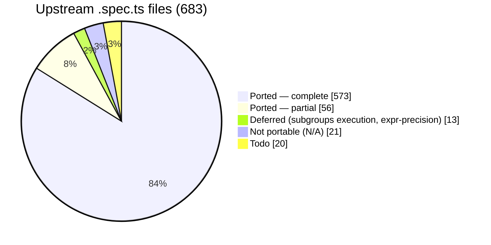
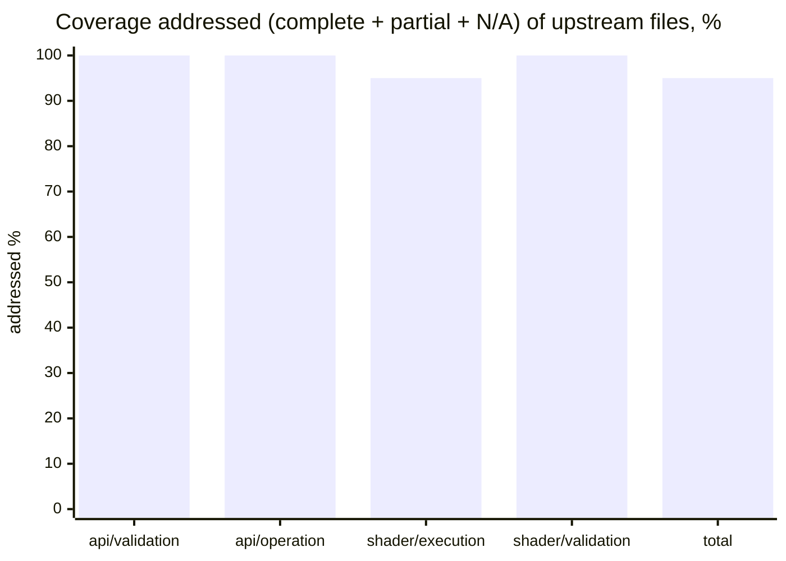

# webgpu-native-cts

A WebGPU Conformance Test Suite (CTS) written in **C++**, targeting the **WebGPU C API**
(`webgpu.h`) directly — no JavaScript engine, no language bindings.

> The *tests* are C++ that call the WebGPU **C** API. C++ is used because the upstream CTS is
> object-oriented, fluent, and closure-based; a C++ port maps to it almost 1:1, which is the
> whole point of a faithful port.

The goal is to port the upstream TypeScript [WebGPU CTS](https://github.com/gpuweb/cts)
as faithfully as practical, so that native WebGPU implementations can be checked for
conformance by linking a small native test binary instead of embedding a full JS runtime.

## Why

The canonical WebGPU CTS is written in TypeScript and runs in a browser or against native
implementations through a JS engine bound to native code:

- **wgpu** runs the CTS via Deno (`deno_webgpu` ops → `wgpu_core`).
- **Dawn** runs the CTS via Node.js NAPI bindings (`dawn_node` → `dawn::native`).

Both approaches require shipping and maintaining a JavaScript runtime and a binding layer.
This project takes a different path: the tests are written directly against the C API that
implementations such as [wgpu-native](https://github.com/gfx-rs/wgpu-native),
[yawgpu](https://github.com/infosia/yawgpu), and
[Dawn](https://dawn.googlesource.com/dawn) export, so the test binary links straight against
the implementation under test.

## Target implementations

Tests are written against the **canonical** `webgpu.h` from
[webgpu-native/webgpu-headers](https://github.com/webgpu-native/webgpu-headers), which all of the
target backends implement. The suite is **link-agnostic**: a build-time option (`CTS_BACKEND`)
selects which implementation to link against. Three backends are targeted, each playing a distinct
role in the cross-implementation comparison:

- **yawgpu** ([github.com/infosia/yawgpu](https://github.com/infosia/yawgpu)) — a from-scratch
  Rust implementation of `webgpu.h` (Metal/Vulkan backends; vendor extensions in a companion
  `yawgpu.h`). The **primary conformance subject** — the implementation this suite exists to validate.
- **Dawn** — Google's C++ reference implementation. It passes the ported suite, so it serves as the
  **conformance oracle**: the ground-truth behaviour against which any backend disagreement is judged.
- **wgpu-native** — the mature Rust implementation (`wgpu_core`); the backend the harness was first
  brought up against, and a third independent data point that keeps the comparison from being a
  two-way tie.

Implementation-specific differences (native feature enums, instance-creation extras like
yawgpu's `YaWGPUInstanceBackendSelect`) are isolated behind a thin backend shim.

## Language

- The entire suite — tests and harness — is **C++20**.
- Tests call the WebGPU **C** API (`webgpu.h`) directly; they do not depend on any C++ wrapper
  for WebGPU itself.
- The harness is a **custom C++ framework that mirrors the upstream CTS framework 1:1**
  (`MakeTestGroup` / `g.test().desc().params().fn()`, fluent parameter builders —
  `combine`/`combineWithParams`/`filter`/`expand`/`beginSubcases` with per-case subcase expansion —
  lambda test bodies, `expectValidationError([&]{ ... }, shouldError)`, the `suite:file:test:params`
  query system, and a case/subcase tree). It is **not** built on GoogleTest, Catch2, doctest, or
  Criterion — those impose a test model that conflicts with the CTS case/subcase split and
  query-string identity. The harness's own logic (params expansion, query parsing, format tables,
  expectation matching) is checked by a small self-test binary, `cts_unittests`, with no third-party
  test framework.

## Repository layout

```
webgpu-native-cts/
├── README.md  CLAUDE.md  LICENSE  CMakeLists.txt
├── docs/                  # Design docs + UPSTREAM / COVERAGE / FINDINGS
├── specs/                 # Per-slice task specs + reference/ (workflow, templates)
├── include/cts/           # Public C++ test-author API (gpu.h, test.h, webgpu.h)
├── src/
│   ├── common/            # Harness: registry, params, query, runner, runtime, webgpu/ (async→sync, backend shim)
│   ├── webgpu/            # Ported tests (.spec.cpp) + capability_info / texture_format tables + listing.json
│   └── unittests/         # Harness self-tests (cts_unittests)
├── expectations/          # Per-backend known-failure lists ({wgpu-native,yawgpu,dawn}.txt)
└── tools/gen_listings/    # Listing generator → src/webgpu/listing.json
```

The build directories (`build-*/`) are git-ignored. The canonical `webgpu.h` is **not** vendored —
each backend supplies its own `webgpu-headers/webgpu.h` (Dawn its generated header), selected by
`CTS_BACKEND` at configure time.

## Status

**Active.** The harness is complete; tests are ported in parallel batches. All three backends build
link-agnostically and run on real GPUs — verified on **macOS / Apple Metal** and **Windows 11 / Vulkan**
(NVIDIA RTX 5060 Ti). Coverage so far: the entire **`api`** surface, all of **`shader/execution`** except
the optional `subgroups` **execution** builtins (P4 math/trig run on a ported FP-interval acceptance
framework — f32/f16/abstract), and **all of `shader/validation`** (parse/statement/expression incl. the
114 builtin signature/type/const-overflow validation specs, on a ported `ShaderValidationTest` enabler).
See [coverage](#port-coverage) below and [COVERAGE](docs/COVERAGE.md).

**Current conformance (Metal whole-suite, 2026-06-20):** yawgpu's `api/*` and the phaseSV1
`shader/validation` subdirs are `fail=0`, and its f32/f16/abstract **runtime** math is Dawn-equal. The
phaseSV2 `shader/validation` additions (parse/statement/expression, 167 files, 2026-06-22) are
**Dawn-oracle verified** (`fail=0` except 48 documented **F-130** divergences); their yawgpu cross-check is
pending a later sweep (the campaign runs Dawn-only for speed). The one open yawgpu item remains **F-124** —
the composite-result (matrix / struct / f16-struct) abstract-float **const-eval** readback (~88 cases).
Per-finding history lives in [FINDINGS](docs/FINDINGS.md); per-backend numbers are in
[Test results](#test-results) below.

### Port coverage

683 upstream `.spec.ts` files at the [pinned revision](docs/UPSTREAM.md):



**The entire `api` surface is done** — all 201 `api/validation` + `api/operation` files are accounted for
(complete, partial, or classified N/A), with **zero remaining todo**. "Addressed" below = complete + partial
+ N/A (every upstream file resolved); the remainder is deferred (`subgroups` execution builtins,
expression-precision execution) or todo.



| Area | Addressed* | Note |
|------|----------:|------|
| `api/validation` | **129 / 129 ✅** | **fully ported** — every file complete (112), partial (14), or N/A (3); no todo (Y-6 V1–V10: capability_checks/features + all 35 limits) |
| `api/operation` | **72 / 72 ✅** | **fully ported** — every file complete (28), partial (42), or N/A (2); no todo. Partials leave some native-portable breadth deferred (vertical-first) |
| `shader/execution` | 226 / 239 | **essentially complete** — structural files + the entire `expression/call/builtin` family: `atomics`, the texture built-in family, sync/derivatives, integer/bit/pack, the **P4 math/trig builtins** on a ported **FP-interval acceptance framework** (f32 / f16 / abstract-float), all **binary/unary operators**, conversions, constructors, and `expression/access/*`. The 13 remaining (phaseY14, in progress) are `subgroup*`/`quadBroadcast`/`quadSwap` **execution** builtins + `texture_utils` (a real 3-`g.test` meta-test, not a util) — **reclassified 2026-06-22 as portable with a Dawn-Metal oracle** (Dawn exposes `WGPUFeatureName_Subgroups` on Metal; the prior "no oracle / N/A" note was stale) |
| `shader/validation` | **207 / 207 ✅** | **fully ported** — phaseSV1 `extension`/`shader_io`/`decl`/`functions`/`types`/`const_assert`/`uniformity` (40) + phaseSV2 `parse` (12), `statement` (17), `expression` (24 non-builtin + 114 builtin signature/type/const-overflow validation specs) — on a ported `ShaderValidationTest` enabler (`expectCompileResult`/`expectPipelineResult`). **Dawn-oracle green** except 48 documented **F-130** divergences (`bitwise_shift:partial_eval_errors` lhs=const); phaseSV1 was 3-backend cross-checked (**F-120** fixed in yawgpu's naga fork incl. full uniformity), phaseSV2 yawgpu cross-check pending |
| **Total** | **650 / 683** | + `web_platform`/`idl` N/A (16); `compat` + misc todo |

\* addressed = complete + partial + N/A (every upstream file resolved). Per-file detail and what each batch
added: [COVERAGE](docs/COVERAGE.md).

### What works

- **Harness, 1:1 with upstream** — registry, fluent params, the `suite:file:test:params` query
  system, fixtures, error scopes, async→sync helpers, listing generator, `cts_unittests` self-tests.
- **Crash containment** — `--isolate` runs each case in a child process (POSIX + Windows), so a
  backend *abort* becomes a contained `crash` result instead of killing the run.
- **Per-backend expectations** (`--expectations`) — runs with known divergences still exit 0,
  with nothing silently masked; `--workers N` shards a full sweep ~10× faster.

### Findings — 126 surfaced to date (F-001…F-126)

**Current state only** — the full per-finding record (what, which backend, root cause, fix history,
commit hashes) lives in [FINDINGS](docs/FINDINGS.md). Every divergence is reported and surfaced —
never masked to make a test pass. The headline: **yawgpu's implementation (`api/*` + `shader/execution`
runtime + the entire `shader/validation` frontend) is conformance-clean on native Metal**; the only open
yawgpu item is **F-124** — the **composite-result** (matrix / struct / f16-struct) abstract-float
const-eval readback (~88 cases; the scalar/vector path is fixed). The const-eval bugs **F-122/F-123/F-125**
and the big naga-frontend block **F-120** (shader/validation + full WGSL uniformity analysis, ~22781 cases)
are **now RESOLVED in yawgpu's naga fork**.

| Bucket | # | Detail |
|--------|--:|--------|
| **yawgpu — open implementation defects** | **1 (partial)** | **F-124** abstract-float const-eval readback — the **scalar/vector** path is **fixed** (`97b4827`); ~88 **composite-result** cases remain (`transpose`/`determinant`/`smoothstep` abstract_float + struct-returning `modf`/`frexp` for abstract & f16), all const-eval `error command buffer`, Dawn-green. (F-122/F-123/F-125 — the other const-eval bugs — now **fixed**.) Plus the 2-case Dawn-leniency `draw,index_buffer_format_dirtying` + F-111, carried as `xfail` |
| yawgpu — fixed & hardware-re-verified | 97 | F-005…F-123 + F-125 incl. **F-120** (shader/validation + graph uniformity analysis), **F-121** (shader-f16), **F-122** (`<<` abstract-int const-eval), **F-123** (`sub_neg` precedence), **F-125** (`atanh` f32 const-eval); full list + commits in [FINDINGS](docs/FINDINGS.md) |
| Spec in flux / feature gap — **not a defect** | 2 | F-085 `sample_mask`/`position` per-sample semantics (gpuweb#5457, cts#4510 pending); F-111 `GPUExternalTexture` on the Vulkan backend — both `xfail` in the Vulkan-only expectation files |
| wgpu-native — open | 23+ | panics F-001–F-021 (contained via `--isolate`); F-015/F-027/F-028/F-036/F-045/F-048/F-052/F-056/F-084/F-088/F-097/F-113; plus upstream-naga shader/validation (no uniformity analysis) + shader-f16 unsupported (bring-up reference) |
| MoltenVK-only translation artifacts — green on native Metal + native Vulkan | 9 | F-104 `copyTextureToTexture` (14512, native-Vulkan-green), F-070 SPIRV-Cross residue, F-033, F-045, F-053/F-068 residuals, F-083, F-086, maxComputeWorkgroupStorageSize |

Buckets overlap where a finding affects several backends (e.g. F-045, F-082).

### Test results

#### Metal whole-suite sweep (macOS) — 462 files, `webgpu:*:*` `--workers 8`

The headline result. Whole-suite totals first; then **fails broken out by area** so naga-lineage
findings are not conflated with yawgpu's own implementation. Reported `fail` is the **real,
per-file-reproducible** count — whole-suite `adapter is "consumed"` / GPU-state-degradation collateral
(verified `fail=0` re-run alone) is excluded.

| Backend | Platform | pass | skip | fail (real) | crash | Verdict |
|---------|----------|-----:|-----:|-----:|------:|---------|
| **Dawn** (oracle) | Metal | 1522679 | 81880 | **0** | 0 | green (oracle). Raw whole-suite 2562 `fail` is all adapter-consumed collateral, excluded |
| **yawgpu** | Metal | 1264728 | 339376 | **~88** | 0 | `api/*` **fail=0**, `shader/validation` **fail=0** (F-120 fixed). The ~88 shader/execution non-passes are F-124 composite-result abstract-float/f16 const-eval (transpose/determinant/smoothstep abstract + modf/frexp); the scalar/vector path + F-122/F-123/F-125 are fixed. ~2443 api degradation collateral excluded |
| **wgpu-native** | Metal | 1003747 | 398626 | 37567 | 38550 | bring-up reference (panic-heavy, **not** triaged) — see area split. Contained via crash-resume |

**Fails by area** — where each backend's non-passes actually live:

| Backend | `api/*` | `shader/execution` | `shader/validation` |
|---------|---------|--------------------|---------------------|
| **yawgpu** | fail 0 (≈2443 degradation collateral, `fail=0` per-file) | **fail ~88** — only **F-124** composite-result abstract-float/f16 const-eval remains (transpose/determinant/smoothstep abstract + struct-returning modf/frexp abstract & f16); the scalar/vector abstract-float path + F-122/F-123/F-125 are fixed. f32/f16/abstract runtime math all green | **fail 0** — F-120 **RESOLVED** (structural validation + full graph uniformity analysis, yawgpu naga fork) |
| **wgpu-native** | degradation collateral | **crash ~31k + fail ~4k** — no `shader-f16` + unimplemented/abstract-float paths panic | **fail 23467** — upstream naga (no uniformity analysis) + broader under-validation; yawgpu's fork fixed this, upstream naga has not |

> **The split is the point:** yawgpu's `api/*` and `shader/validation` are now **fully green**; its only
> non-passes are **const-eval** in `shader/execution` — the shared-naga abstract-float readback (F-124,
> wgpu-native crashes the same cases) plus three small yawgpu-only const-eval bugs (F-122/F-123/F-125).
> The f32/f16/abstract **runtime** math is entirely green, confirming yawgpu's HAL math + the FP-interval
> framework agree with Dawn.

**Skips:** large because of legitimately **feature-unsupported** cases on yawgpu's Metal adapter — chiefly
`subgroups` (the `uniformity` subgroup g.tests alone skip ~133k) and `unrestricted_pointer_parameters`,
plus the `subgroup*`/`quad*` execution builtins (deferred, no Metal oracle). Dawn has these features so it
runs them. yawgpu's **`shader-f16` runs fully** (all f16 math/operators green, Dawn-equal).

#### MoltenVK whole-suite sweep (macOS / Vulkan) — 462 files, `CTS_YAWGPU_BACKEND=vulkan` + MoltenVK

| Backend | Platform | pass | skip | fail (real) | crash | Verdict |
|---------|----------|-----:|-----:|-----:|------:|---------|
| **yawgpu** | Vulkan (MoltenVK) | 1249037 | 339376 | **16154** | 16 | Vulkan-path residuals — **no new yawgpu-core defects**, and `shader/validation` **fail=0** (F-120 fork fix applies to Vulkan too). Decomposes into: **F-104** `copyTextureToTexture` 14512 (MoltenVK-only translation artifact, native-Vulkan-green, fail=14512 in isolation); **F-070-family** SPIRV-Cross residue (`zero_init`/`robust_access_vertex`/`shader_io,fragment_builtins`, MoltenVK-only); + `shader/execution` const-eval (F-124/F-122/F-123/F-125, same as Metal). Raw whole-suite `fail=18692` also includes ~2538 degradation collateral (`fail=0` per-file) — excluded |

#### Native Vulkan whole-suite sweep (Windows 11 / NVIDIA RTX 5060 Ti) — 462 files, `cts.exe --isolate`

The native-Vulkan platform result. yawgpu's native Vulkan HAL also passes the entire ported suite; the
only `shader/execution` non-passes are the same **const-eval** set as Metal (F-124 + F-122/F-123/F-125),
and `shader/validation` is `fail=0` (F-120 fork fix applies to Vulkan too). The MoltenVK translation
artifacts (F-104 `copyTextureToTexture`, F-070-family SPIRV-Cross residue) are **not** yawgpu defects —
each is green on native Vulkan.

This sweep ran on the **Jun-19 `yawgpu.dll`**, which predates the naga fixes (F-120 uniformity/
shader-validation, F-121 f16, F-122/F-123/F-125, F-124 scalar/vector), so the shader/validation + f16
fails below are **expected residuals of already-resolved findings**, not new defects. On this box raw
long sweeps **hard-freeze the machine** (a CPU-thermal limit, see **F-126**), so it was run in
thermal-safe chunks with cooldowns and reached completion at **crash=0, no freeze**.

**Counts are per-case** (`--isolate` = one process per case) — **not comparable** to the per-subcase
Metal/MoltenVK rows above. Fails are per-subcase.

| Backend | Platform | pass (case) | skip (case) | fail (subcase) | crash | xfail |
|---------|----------|-----:|-----:|-----:|------:|------:|
| **yawgpu** | Vulkan (native, NVIDIA RTX 5060 Ti) — **Jun-19 build** | 89794 | 59058 | **594** | 0 | 11 |

- **~500 of the 594 are already-resolved or known-`xfail` on this pre-fix build:** `shader/validation`
  **476** (**F-120** — `uniformity` 409 + shader_io/decl/etc; RESOLVED post-Jun-19), f16 **14** (**F-121**),
  `fragment_builtins`/`render_pipeline,misc` **10** (**F-085**/**F-111** `xfail`).
- **Genuinely-new native-Vulkan candidates (~92, need a post-rebuild re-sweep before filing):**
  `shader,execution,robust_access` **24** (OOB write not clamped — `expected 0, got 3`), `textureStore`
  `rgb10a2unorm` 3d/2d-array **20** (format pack), `textureLoad` `*-srgb` **24** (green-channel sRGB-decode
  rounding, minor), `fwidth`/`fwidthFine`/`fwidthCoarse` f32 **24** (derivatives), and 1 `compute_pass`
  `indirect_dispatch_buffer,usage` (`HAL queue submission failed`). Full decomposition in
  [FINDINGS](docs/FINDINGS.md).

#### wgpu-native (native Vulkan) — bring-up reference

A **whole-suite** Vulkan run (234-file listing, `--workers 8`) measures
`pass=289054 skip=215886 fail=9551 crash=7967 xfail=92` (raw). These are **not new defects** — they
are the wgpu-native panic + missing-validation families already recorded per area in
[COVERAGE](docs/COVERAGE.md) as *bring-up reference* (F-097 device-lost 2568; F-027/F-028 3D
copy/readback ≈3000; the F-092-area depth-readonly gaps 864; limits/alignment `unimplemented!()`
panics, contained as `crash` by `--workers` crash-resume). wgpu-native's
`expectations/wgpu-native-vulkan.txt` (8 lines) has **not yet been regenerated for the grown suite**,
so a full run is not triaged to `fail=0 crash=0` — regenerating
it via `--isolate --emit-crash-list` is pending. yawgpu remains the **primary** conformance subject;
wgpu-native is the bring-up reference.

Design and roadmap live in [`docs/`](docs/) — start with [`docs/00-overview.md`](docs/00-overview.md)
and [`docs/07-roadmap.md`](docs/07-roadmap.md).

## Documentation map

| Document | Contents |
|----------|----------|
| [00-overview](docs/00-overview.md) | Goals, non-goals, scope, key decisions |
| [01-architecture](docs/01-architecture.md) | Component architecture; TS-CTS → C mapping |
| [02-harness](docs/02-harness.md) | Registry, fixtures, params, query, tree, runner, listing |
| [03-webgpu-c-abstraction](docs/03-webgpu-c-abstraction.md) | Async→sync helpers, error scopes, backend shim |
| [04-authoring-tests](docs/04-authoring-tests.md) | Test-author API (C++) and worked example |
| [05-porting-guide](docs/05-porting-guide.md) | How to port a `.spec.ts` to a `.spec.cpp` |
| [06-build-and-run](docs/06-build-and-run.md) | CMake build, backend selection, running, filtering |
| [07-roadmap](docs/07-roadmap.md) | Roadmap and remaining work |
| [UPSTREAM](docs/UPSTREAM.md) | Pinned upstream CTS / header / backend revisions |
| [COVERAGE](docs/COVERAGE.md) | Per-area / per-file port status |
| [FINDINGS](docs/FINDINGS.md) | Per-backend conformance defects the suite surfaced |

## License

**BSD-3-Clause** (see [`LICENSE`](LICENSE)), matching the upstream CTS so that ported test logic —
a derivative work — stays license-compatible. Each ported file must preserve upstream attribution;
see [05-porting-guide §0](docs/05-porting-guide.md).
