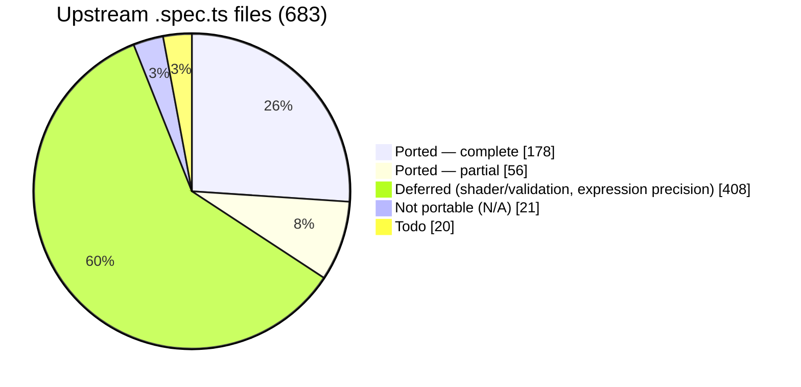
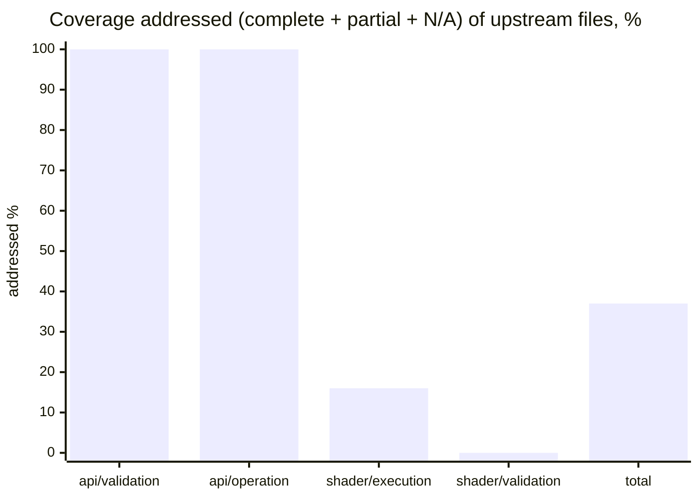

# webgpu-native-cts

A WebGPU Conformance Test Suite (CTS) written in **C++**, targeting the **WebGPU C API**
(`webgpu.h`) directly — no JavaScript engine, no language bindings.

> The *tests* are C++ that call the WebGPU **C** API. C++ is used because the upstream CTS is
> object-oriented, fluent, and closure-based; a C++ port maps to it almost 1:1, which is the
> whole point of a faithful port.

The goal is to port the upstream TypeScript [WebGPU CTS](https://github.com/gpuweb/cts)
as faithfully as practical, so that native WebGPU implementations can be checked for
conformance by linking a small native test binary instead of embedding a full JS runtime.

## Why

The canonical WebGPU CTS is written in TypeScript and runs in a browser or against native
implementations through a JS engine bound to native code:

- **wgpu** runs the CTS via Deno (`deno_webgpu` ops → `wgpu_core`).
- **Dawn** runs the CTS via Node.js NAPI bindings (`dawn_node` → `dawn::native`).

Both approaches require shipping and maintaining a JavaScript runtime and a binding layer.
This project takes a different path: the tests are written directly against the C API that
implementations such as [wgpu-native](https://github.com/gfx-rs/wgpu-native),
[yawgpu](https://github.com/infosia/yawgpu), and
[Dawn](https://dawn.googlesource.com/dawn) export, so the test binary links straight against
the implementation under test.

## Target implementations

Tests are written against the **canonical** `webgpu.h` from
[webgpu-native/webgpu-headers](https://github.com/webgpu-native/webgpu-headers), which all of the
target backends implement. The suite is **link-agnostic**: a build-time option (`CTS_BACKEND`)
selects which implementation to link against. Three backends are targeted, each playing a distinct
role in the cross-implementation comparison:

- **yawgpu** ([github.com/infosia/yawgpu](https://github.com/infosia/yawgpu)) — a from-scratch
  Rust implementation of `webgpu.h` (Metal/Vulkan backends; vendor extensions in a companion
  `yawgpu.h`). The **primary conformance subject** — the implementation this suite exists to validate.
- **Dawn** — Google's C++ reference implementation. It passes the ported suite, so it serves as the
  **conformance oracle**: the ground-truth behaviour against which any backend disagreement is judged.
- **wgpu-native** — the mature Rust implementation (`wgpu_core`); the backend the harness was first
  brought up against, and a third independent data point that keeps the comparison from being a
  two-way tie.

Implementation-specific differences (native feature enums, instance-creation extras like
yawgpu's `YaWGPUInstanceBackendSelect`) are isolated behind a thin backend shim.

## Language

- The entire suite — tests and harness — is **C++20**.
- Tests call the WebGPU **C** API (`webgpu.h`) directly; they do not depend on any C++ wrapper
  for WebGPU itself.
- The harness is a **custom C++ framework that mirrors the upstream CTS framework 1:1**
  (`MakeTestGroup` / `g.test().desc().params().fn()`, fluent parameter builders —
  `combine`/`combineWithParams`/`filter`/`expand`/`beginSubcases` with per-case subcase expansion —
  lambda test bodies, `expectValidationError([&]{ ... }, shouldError)`, the `suite:file:test:params`
  query system, and a case/subcase tree). It is **not** built on GoogleTest, Catch2, doctest, or
  Criterion — those impose a test model that conflicts with the CTS case/subcase split and
  query-string identity. The harness's own logic (params expansion, query parsing, format tables,
  expectation matching) is checked by a small self-test binary, `cts_unittests`, with no third-party
  test framework.

## Repository layout

```
webgpu-native-cts/
├── README.md  CLAUDE.md  LICENSE  CMakeLists.txt
├── docs/                  # Design docs + UPSTREAM / COVERAGE / FINDINGS
├── specs/                 # Per-slice task specs + reference/ (workflow, templates)
├── include/cts/           # Public C++ test-author API (gpu.h, test.h, webgpu.h)
├── src/
│   ├── common/            # Harness: registry, params, query, runner, runtime, webgpu/ (async→sync, backend shim)
│   ├── webgpu/            # Ported tests (.spec.cpp) + capability_info / texture_format tables + listing.json
│   └── unittests/         # Harness self-tests (cts_unittests)
├── expectations/          # Per-backend known-failure lists ({wgpu-native,yawgpu,dawn}.txt)
└── tools/gen_listings/    # Listing generator → src/webgpu/listing.json
```

The build directories (`build-*/`) are git-ignored. The canonical `webgpu.h` is **not** vendored —
each backend supplies its own `webgpu-headers/webgpu.h` (Dawn its generated header), selected by
`CTS_BACKEND` at configure time.

## Status

**Active.** The harness is complete; tests are being ported in parallel batches. All three
backends build link-agnostically and run on real GPUs — verified on **macOS / Apple Metal** and
**Windows 11 / Vulkan** (NVIDIA GeForce RTX 5060 Ti). Last full sweep: **2026-06-11**.

### Port coverage

683 upstream `.spec.ts` files at the [pinned revision](docs/UPSTREAM.md):



**The entire `api` surface is done** — all 201 `api/validation` + `api/operation` files are accounted for
(complete, partial, or classified N/A), with **zero remaining todo**. "Addressed" below = complete + partial
+ N/A (every upstream file resolved); the remainder is deferred (`shader/validation`, expression-precision
execution) or todo.



| Area | Addressed* | Note |
|------|----------:|------|
| `api/validation` | **129 / 129 ✅** | **fully ported** — every file complete (112), partial (14), or N/A (3); no todo (Y-6 V1–V10: capability_checks/features + all 35 limits) |
| `api/operation` | **72 / 72 ✅** | **fully ported** — every file complete (28), partial (42), or N/A (2); no todo. Partials leave some native-portable breadth deferred (vertical-first) |
| `shader/execution` | 38 / 239 | structural files + the `flow_control`, `memory_model`, `statement`, `shader_io` trees; rest deferred |
| `shader/validation` | 0 / 207 | deferred |
| **Total** | **255 / 683** | + `web_platform`/`idl` N/A (16); `compat` + misc todo |

\* addressed = complete + partial + N/A (every upstream file resolved). Per-file detail and what each batch
added: [COVERAGE](docs/COVERAGE.md).

### What works

- **Harness, 1:1 with upstream** — registry, fluent params, the `suite:file:test:params` query
  system, fixtures, error scopes, async→sync helpers, listing generator, `cts_unittests` self-tests.
- **Crash containment** — `--isolate` runs each case in a child process (POSIX + Windows), so a
  backend *abort* becomes a contained `crash` result instead of killing the run.
- **Per-backend expectations** (`--expectations`) — runs with known divergences still exit 0,
  with nothing silently masked; `--workers N` shards a full sweep ~10× faster.

### Backends at a glance

| Backend | Role | Metal | Vulkan (Windows) | Open findings |
|---------|------|:-----:|:----------------:|---------------|
| **yawgpu** | primary subject | ✅ green | ✅ green | **2** — F-095/F-096 (buffer + texture usage-scope conflicts not detected), cross-HAL; **74 findings fixed** (incl. the 2026-06-14 batch F-089/F-090/F-091/F-092/F-093/F-094/F-098/F-099/F-101/F-102) |
| **Dawn** | conformance oracle | ✅ green | not built yet | 0 |
| **wgpu-native** | third data point | ⚠️ | ⚠️ (contained) | **22** — eager panics, missing validation, 3D copy/readback, rendering, device-lost state |

### Findings — 102 surfaced to date (F-001…F-102)

The full per-finding record (what, which backend, root cause, status) lives in
[FINDINGS](docs/FINDINGS.md). Every divergence is reported and surfaced — never masked to make a
test pass.

| Bucket | # | Representative findings |
|--------|--:|-------------------------|
| yawgpu — open | 2 | F-095/F-096 (buffer + texture subresource usage-scope conflicts not detected in a render pass) — cross-HAL, Dawn + wgpu-native both reject |
| yawgpu — fixed & hardware-re-verified | 74 | F-005…F-082, F-087, and the **2026-06-14** batch F-089/F-090/F-091/F-092/F-093/F-094/F-098/F-099/F-101/F-102 (re-verified green on Metal + MoltenVK); nothing masked |
| wgpu-native — open | 22 | panics F-001–F-021 (contained via `--isolate`); F-015 view-usage validation; F-027/F-028 3D copy/readback; F-036/F-045/F-048/F-052/F-056 rendering; F-084 weak memory; F-088 lifecycle panics; F-097 device-lost state |
| MoltenVK-only translation artifacts — green on native Vulkan, not yawgpu defects | 7 | F-033, F-045, F-053/F-068 residuals, F-083, F-086; maxComputeWorkgroupStorageSize at-limit SPIR-V compile residual (Metal green) |
| Spec in flux — **not an implementation defect** | 1 | F-085 `sample_mask`/`position` per-sample semantics (gpuweb/gpuweb#5457, cts#4510 pending); 92 cases `xfail` in the Vulkan-only expectation files for yawgpu **and** wgpu-native |
| naga-lineage residuals (tracked upstream) | 2 | F-070 memory layout / matCx3 padding / `shadow:loop` (Metal 9 / MoltenVK 53); F-100 out-of-range `@binding` rejected at `createShaderModule` not pipeline creation (yawgpu cross-HAL; wgpu-native crashes). F-091 (MSL writer panic on generated vertex shaders) **fixed on yawgpu Metal** 2026-06-14 |

Buckets overlap where a finding affects several backends (e.g. F-045, F-082).

### Test results

Measured per case at the [pinned revisions](docs/UPSTREAM.md) — Vulkan rows 2026-06-08, Metal
operation sweep 2026-06-06.

#### `api,validation` (`--isolate`, one subprocess per case)

| Backend | Platform | pass | skip | xfail | xpass | fail | crash |
|---------|----------|-----:|-----:|------:|------:|-----:|------:|
| **Dawn** | Metal | 4324 | 391 | – | – | 0 | 0 |
| **yawgpu** | Metal | 4332 | 383 | – | – | 0 | 0 |
| **yawgpu** | Vulkan | 3257 | 1458 | 0 | 0 | 0 | 0 |
| **wgpu-native** | Metal | 3407 | 756 | – | – | 338 | 214 |
| **wgpu-native** | Vulkan | 2507 | 1770 | 438 | 218 | 0 | 0 |

- The Metal rows cover the original hand-ported vertical-slice files; the 40 bulk-ported files are
  verified separately (Dawn-green, yawgpu swept on both HALs) and fold in on the next regen.
- Per-backend case totals differ because each adapter's optional-feature set changes how the
  format-swept tests parametrize.
- wgpu-native's fails/crashes are the panic + missing-validation families (F-001–F-021; F-015
  ≈ 324 cases); with `--isolate --expectations` its Vulkan run exits 0 (`fail=0 crash=0`).

#### `api,operation`

| Backend | Platform | Result (leaf subcases) |
|---------|----------|------------------------|
| **Dawn** | Metal | `pass=247751 fail=0 crash=0` |
| **yawgpu** | Metal | `pass=247579 fail=0 crash=0` |
| **yawgpu** | Vulkan | `pass=214039 skip=85698 fail=0 crash=0` — full suite, exit 0 in ~2 min (`--workers 16`), nothing masked |
| **wgpu-native** | Metal | `pass=3322 fail=78 xfail=3` — fails are the 3D copy/readback findings F-027/F-028 |

yawgpu's operation results on native Vulkan **match Metal exactly**; the only Mac-side artifacts
are the MoltenVK translation bucket above, absent on native Vulkan.

Design and roadmap live in [`docs/`](docs/) — start with [`docs/00-overview.md`](docs/00-overview.md)
and [`docs/07-roadmap.md`](docs/07-roadmap.md).

## Documentation map

| Document | Contents |
|----------|----------|
| [00-overview](docs/00-overview.md) | Goals, non-goals, scope, key decisions |
| [01-architecture](docs/01-architecture.md) | Component architecture; TS-CTS → C mapping |
| [02-harness](docs/02-harness.md) | Registry, fixtures, params, query, tree, runner, listing |
| [03-webgpu-c-abstraction](docs/03-webgpu-c-abstraction.md) | Async→sync helpers, error scopes, backend shim |
| [04-authoring-tests](docs/04-authoring-tests.md) | Test-author API (C++) and worked example |
| [05-porting-guide](docs/05-porting-guide.md) | How to port a `.spec.ts` to a `.spec.cpp` |
| [06-build-and-run](docs/06-build-and-run.md) | CMake build, backend selection, running, filtering |
| [07-roadmap](docs/07-roadmap.md) | Phased milestones |
| [UPSTREAM](docs/UPSTREAM.md) | Pinned upstream CTS / header / backend revisions |
| [COVERAGE](docs/COVERAGE.md) | Per-area / per-file port status |
| [FINDINGS](docs/FINDINGS.md) | Per-backend conformance defects the suite surfaced |

## License

**BSD-3-Clause** (see [`LICENSE`](LICENSE)), matching the upstream CTS so that ported test logic —
a derivative work — stays license-compatible. Each ported file must preserve upstream attribution;
see [05-porting-guide §0](docs/05-porting-guide.md).
