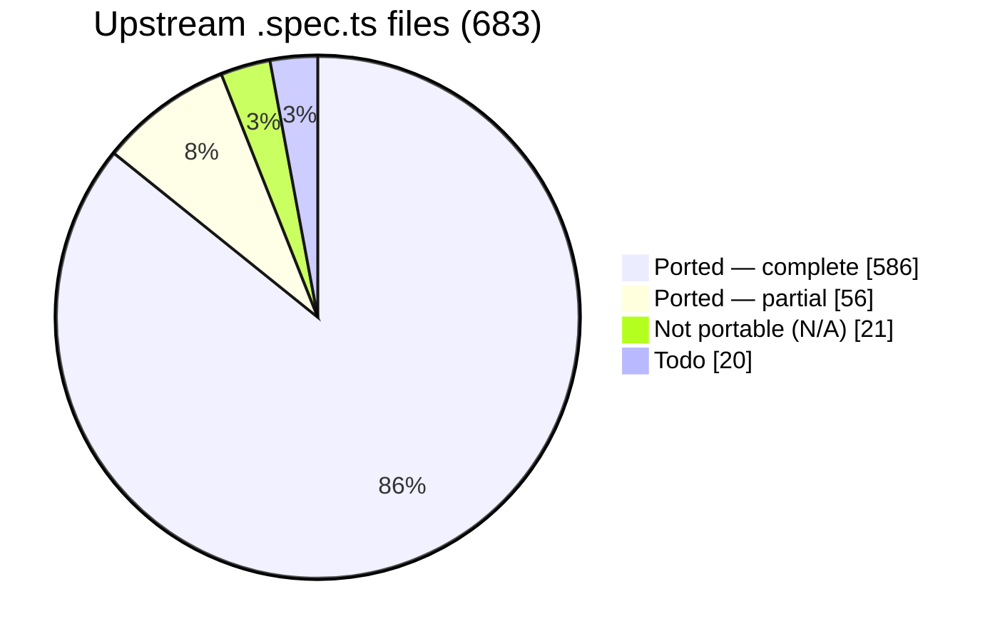

# webgpu-native-cts

A WebGPU Conformance Test Suite (CTS) written in **C++**, targeting the **WebGPU C API**
(`webgpu.h`) directly — no JavaScript engine, no language bindings.

> The *tests* are C++ that call the WebGPU **C** API. C++ is used because the upstream CTS is
> object-oriented, fluent, and closure-based; a C++ port maps to it almost 1:1, which is the
> whole point of a faithful port.

The goal is to port the upstream TypeScript [WebGPU CTS](https://github.com/gpuweb/cts)
as faithfully as practical, so that native WebGPU implementations can be checked for
conformance by linking a small native test binary instead of embedding a full JS runtime.

## Why

The canonical WebGPU CTS is written in TypeScript and runs in a browser or against native
implementations through a JS engine bound to native code:

- **wgpu** runs the CTS via Deno (`deno_webgpu` ops → `wgpu_core`).
- **Dawn** runs the CTS via Node.js NAPI bindings (`dawn_node` → `dawn::native`).

Both approaches require shipping and maintaining a JavaScript runtime and a binding layer.
This project takes a different path: the tests are written directly against the C API that
implementations such as [wgpu-native](https://github.com/gfx-rs/wgpu-native),
[yawgpu](https://github.com/infosia/yawgpu), and
[Dawn](https://dawn.googlesource.com/dawn) export, so the test binary links straight against
the implementation under test.

## Target implementations

Tests are written against the **canonical** `webgpu.h` from
[webgpu-native/webgpu-headers](https://github.com/webgpu-native/webgpu-headers), which all of the
target backends implement. The suite is **link-agnostic**: a build-time option (`CTS_BACKEND`)
selects which implementation to link against. Three backends are targeted, each playing a distinct
role in the cross-implementation comparison:

- **yawgpu** ([github.com/infosia/yawgpu](https://github.com/infosia/yawgpu)) — a from-scratch
  Rust implementation of `webgpu.h` (Metal/Vulkan backends). Its WGSL frontend is **Tint** — the same
  shader compiler Dawn uses — so its shader-compile, const-eval, and validation behaviour is
  byte-equivalent to the oracle. The **primary conformance subject**: this suite exists to validate it.
  On native Metal it runs the suite crash-free with `shader/execution` fully green and its fail profile
  **byte-identical to the Dawn oracle** — both fail only the 2 shared `index_buffer_format_dirtying`
  port-oracle non-defects. Reporting real Metal hardware limits and exposing `subgroups` brings its coverage
  up to Dawn's level (see [Test results](#test-results)). Its vendor-extension surface (the companion
  `yawgpu.h`) is **not yet exercised** by the suite — only the canonical `webgpu.h` is tested today.
- **Dawn** — Google's C++ reference implementation. It passes the ported suite, so it serves as the
  **conformance oracle**: the ground-truth behaviour against which any backend disagreement is judged.
  Since yawgpu and Dawn now share the Tint frontend, they agree on shader compilation and validation.
- **wgpu-native** — the mature Rust implementation (`wgpu_core`), still on the **naga** WGSL frontend;
  the backend the harness was first brought up against, and a third independent data point. Being the
  one remaining naga-based backend, it is now where the naga-lineage shader findings (const-eval,
  frontend-validation, `discard`-derivative) still manifest after yawgpu moved to Tint.

Implementation-specific differences (native feature enums, instance-creation extras like
yawgpu's `YaWGPUInstanceBackendSelect` backend selector) are isolated behind a thin backend shim.

## Language

- The entire suite — tests and harness — is **C++20**.
- Tests call the WebGPU **C** API (`webgpu.h`) directly; they do not depend on any C++ wrapper
  for WebGPU itself.
- The harness is a **custom C++ framework that mirrors the upstream CTS framework 1:1**
  (`MakeTestGroup` / `g.test().desc().params().fn()`, fluent parameter builders —
  `combine`/`combineWithParams`/`filter`/`expand`/`beginSubcases` with per-case subcase expansion —
  lambda test bodies, `expectValidationError([&]{ ... }, shouldError)`, the `suite:file:test:params`
  query system, and a case/subcase tree). It is **not** built on GoogleTest, Catch2, doctest, or
  Criterion — those impose a test model that conflicts with the CTS case/subcase split and
  query-string identity. The harness's own logic (params expansion, query parsing, format tables,
  expectation matching) is checked by a small self-test binary, `cts_unittests`, with no third-party
  test framework.

## Repository layout

```
webgpu-native-cts/
├── README.md  CLAUDE.md  LICENSE  CMakeLists.txt
├── docs/                  # Design docs + UPSTREAM / COVERAGE / FINDINGS
├── specs/                 # Per-slice task specs + reference/ (workflow, templates)
├── include/cts/           # Public C++ test-author API (gpu.h, test.h, webgpu.h)
├── src/
│   ├── common/            # Harness: registry, params, query, runner, runtime, webgpu/ (async→sync, backend shim)
│   ├── webgpu/            # Ported tests (.spec.cpp) + capability_info / texture_format tables + listing.json
│   └── unittests/         # Harness self-tests (cts_unittests)
├── expectations/          # Per-backend known-failure lists ({wgpu-native,yawgpu,dawn}.txt)
└── tools/gen_listings/    # Listing generator → src/webgpu/listing.json
```

The build directories (`build-*/`) are git-ignored. The canonical `webgpu.h` is **not** vendored —
each backend supplies its own `webgpu-headers/webgpu.h` (Dawn its generated header), selected by
`CTS_BACKEND` at configure time.

## Status

**Active.** The harness is complete and all three backends build link-agnostically and run on real GPUs
(**macOS / Apple Metal** and **Windows 11 / Vulkan**, NVIDIA RTX 5060 Ti). **Every portable upstream area is
ported:** the entire **`api`** surface (`api/validation` + `api/operation`), **all of `shader/execution`**
(the FP-interval f32/f16/abstract math framework, the `subgroup*`/`quad*` execution builtins on a ported
`subgroup_util` engine, and the `texture_utils` meta-test), and **all of `shader/validation`**
(parse/statement/expression + the 114 builtin signature/type/const-overflow specs, on a ported
`ShaderValidationTest` enabler). The only unported upstream is `compat` (todo) and `web_platform`/`idl`
(N/A — no C-API surface). See [coverage](#port-coverage) below and [COVERAGE](docs/COVERAGE.md).

**Conformance (current).** yawgpu's WGSL frontend is now **Tint** (Dawn's shader compiler), replacing the
earlier naga frontend. With Tint, yawgpu's shader-compile behaviour is byte-equivalent to the Dawn oracle:
`shader/execution` is **`fail=0 crash=0`** on both real-hardware paths (native macOS/Metal — 822,636 subcase
passes — and native Windows/Vulkan, NVIDIA RTX 5060 Ti), and the whole suite runs **crash-free**. Reporting
real Metal hardware limits and exposing `subgroups` brings yawgpu's Metal coverage up to Dawn's level (skip
104,493 — Dawn is 104,506). On Metal the raw total is **1,991,818** subcase passes with **2** fails (the 2
shared `index_buffer_format_dirtying` port-oracle non-defects); on Vulkan 1,607,298 passes, modulo a small
set of known **non-defect** `xfail`s (spec-in-flux per-sample semantics, GPU-divergent external-texture
SPIR-V, an NVIDIA denormal/memory-model artifact that Dawn reproduces identically on the same GPU). yawgpu's
fail profile on Metal is **byte-identical to Dawn** (both fail only the 2 port-oracle cases). The
naga-lineage findings (const-eval, `discard`-derivative, frontend-validation) still do not manifest on yawgpu
— they appear only on **wgpu-native**, the one remaining naga-based backend and a panic-heavy bring-up
reference. Per-backend numbers: [Test results](#test-results); per-finding detail:
[FINDINGS](docs/FINDINGS.md).

### Port coverage

683 upstream `.spec.ts` files at the [pinned revision](docs/UPSTREAM.md):



**Every portable area is done** — all 201 `api/*` files and all 446 `shader/*` files (execution +
validation) are accounted for (complete, partial, or classified N/A), with **zero remaining todo** in those
areas. "Addressed" below = complete + partial + N/A (every upstream file resolved); the only remainder is
`compat` (todo) and `web_platform`/`idl` (N/A).

| Area | Addressed* | Note |
|------|----------:|------|
| `api/validation` | **129 / 129 ✅** | **fully ported** — every file complete (112), partial (14), or N/A (3); no todo (Y-6 V1–V10: capability_checks/features + all 35 limits) |
| `api/operation` | **72 / 72 ✅** | **fully ported** — every file complete (28), partial (42), or N/A (2); no todo. Partials leave some native-portable breadth deferred (vertical-first) |
| `shader/execution` | **239 / 239 ✅** | **fully ported** — structural files + the entire `expression/call/builtin` family: `atomics`, the texture built-in family, sync/derivatives, integer/bit/pack, the **P4 math/trig builtins** on a ported **FP-interval acceptance framework** (f32 / f16 / abstract-float), all **binary/unary operators**, conversions, constructors, `expression/access/*`, the `subgroup*`/`quadBroadcast`/`quadSwap` **execution** builtins (on a ported `subgroup_util` compute/fragment/accuracy engine), and the `texture_utils` meta-test. Dawn-oracle green (fail=0; subgroup-size gates honored — Dawn-Metal `subgroupMaxSize=32`); **yawgpu is `fail=0` here too** (Tint frontend, Dawn-equivalent) |
| `shader/validation` | **207 / 207 ✅** | **fully ported** — `extension`/`shader_io`/`decl`/`functions`/`types`/`const_assert`/`uniformity`, `parse`, `statement`, and `expression` (incl. all 114 builtin signature/type/const-overflow specs) on a ported `ShaderValidationTest` enabler (`expectCompileResult`/`expectPipelineResult`). **Dawn-oracle green** (`fail=0`); **yawgpu is `fail=0` here too** — byte-identical to Dawn, including the `subgroups`-gated cases (`parse,requires:wgsl_matches_api`, `uniformity:uniform_subgroup_ops`), since it shares the Tint frontend. The naga-lineage validation gaps (**F-133**/**F-134**) remain only on wgpu-native |
| **Total** | **663 / 683** | + `web_platform`/`idl` N/A (16); `compat` + misc todo |

\* addressed = complete + partial + N/A (every upstream file resolved). Per-file detail and what each batch
added: [COVERAGE](docs/COVERAGE.md).

### What works

- **Harness, 1:1 with upstream** — registry, fluent params, the `suite:file:test:params` query
  system, fixtures, error scopes, async→sync helpers, listing generator, `cts_unittests` self-tests.
- **Crash containment** — `--isolate` runs each case in a child process (POSIX + Windows), so a
  backend *abort* becomes a contained `crash` result instead of killing the run.
- **Per-backend expectations** (`--expectations`) — runs with known divergences still exit 0,
  with nothing silently masked; `--workers N` shards a full sweep ~10× faster.

### Test results

Per-area `pass / skip / fail / crash` from a full sweep of all **642 ported files** — on
**macOS / Apple Metal** (the three tables below) and on **Windows 11 / native Vulkan** (NVIDIA RTX 5060 Ti;
the yawgpu-Vulkan table further down). The **yawgpu-Metal** and **Dawn-Metal** tables were both **re-swept
2026-07-03** (`--workers 6`, post-F-146 — the worker-mode harness bug that used to fake-fail parallel Metal
sweeps is fixed, so parallel numbers are authoritative again); the **wgpu-native-Metal** table is from
2026-07-02; the yawgpu-Vulkan table is from the 2026-06-28 sweep. All three Metal backends
now run whole-suite **per-subcase** (`--workers`, no `--isolate`): yawgpu and Dawn never abort; wgpu-native is
panic-heavy but the parallel runner contains each abort (records it as one `crash`, case-level, and continues
via a fresh forked worker), so it no longer needs `--isolate`. Because wgpu-native runs many cases per worker
**process**, an abort can contaminate later cases in the same process — so its `crash` count is inflated ~4×
versus a per-case isolate run (see the note under its table); read its numbers as run-mode-sensitive, not a
like-for-like comparison to the robust backends. All tables are **raw** (no `--expectations`), so documented
non-defects show in `fail` with a dagger note rather than being masked.

#### yawgpu — native Metal (Tint frontend), per-subcase

| area | pass | skip | fail | crash |
|------|------:|-----:|-----:|------:|
| `api/validation` (126) | 293,557 | 61,433 | 2† | 0 |
| `api/operation` (70) | 228,852 | 741 | 0 | 0 |
| `shader/execution` (239) | 822,636 | 21,950 | 0 | 0 |
| `shader/validation` (207) | 646,773 | 20,369 | 0 | 0 |
| **total** | **1,991,818** | **104,493** | **2†** | **0** |

#### Dawn — native Metal (conformance oracle, Tint frontend), per-subcase

| area | pass | skip | fail | crash |
|------|------:|-----:|-----:|------:|
| `api/validation` (126) | 293,547 | 61,443 | 2† | 0 |
| `api/operation` (70) | 228,849 | 744 | 0 | 0 |
| `shader/execution` (239) | 822,636 | 21,950 | 0 | 0 |
| `shader/validation` (207) | 646,773 | 20,369 | 0 | 0 |
| **total** | **1,991,805** | **104,506** | **2** | **0** |

† The **2** `draw,index_buffer_format_dirtying` cases are a CTS-port-oracle quirk: the oracle expects the
dirtied-format draw to succeed, but **both** Dawn and yawgpu reject it (the render bundle becomes an error
bundle). It fails identically on every backend — **not a yawgpu defect** — and is carried as `xfail`.

Reporting real Metal hardware limits and exposing `subgroups` dropped yawgpu's skip count to Dawn's level
(104,493 vs Dawn's 104,506, same-day sweeps), so both backends run the same cases — including the
`requestDevice:limits,supported` real-limit cases and the `subgroups`-gated `shader/validation` trees
(`parse,requires:wgsl_matches_api`, `uniformity:uniform_subgroup_ops`) — and yawgpu passes them all, matching
Dawn's `fail=0`. Both shader areas are **byte-identical** between the two tables (`shader/execution`
822,636 / 21,950; `shader/validation` 646,773 / 20,369). The entire remaining coverage delta is
**13 subcases that Dawn skips and yawgpu runs (and passes)** — the 10 `capability_checks,limits,maxBufferSize`
`createBuffer,at_over` subcases and the 3 `requestAdapter` `forceFallbackAdapter=true` subcases — i.e.
capability-exposure differences on this hardware, not conformance divergence.

#### wgpu-native — native Metal (bring-up reference, naga frontend), per-subcase

| area | pass | skip | fail | crash |
|------|------:|-----:|-----:|------:|
| `api/validation` (126) | 165,877 | 84,634 | 17,445 | 7,043 |
| `api/operation` (70) | 145,018 | 76,709 | 2,771 | 1,669 |
| `shader/execution` (239) | 63,365 | 130,051 | 1,840 | 121,797 |
| `shader/validation` (207) | 251,905 | 316,541 | 98,696 | 0 |
| **total** | **626,165** | **607,935** | **120,752** | **130,509** |

wgpu-native is still on the **naga** WGSL frontend and is a panic-heavy bring-up reference, now run
**per-subcase** (`--workers`, no `--isolate`) like the other backends. crash **130,509** — all genuine aborts
(signal 6, not timeouts) — is dominated by `shader/execution` (121,797). That is **~4× the per-case isolate
count** (a 2026-06-28 isolate run of `shader/execution` saw crash 31,537): with many cases sharing one worker
process, an abort contaminates subsequent cases, so much of this reflects **shared-process execution**, not
distinct backend defects — and pass is correspondingly deflated. Its `shader/validation` fail 98,696 is the
naga frontend/const-eval gap (**F-133**) that yawgpu no longer has after moving to Tint. Not triaged to
`fail=0`; these numbers are run-mode-sensitive and not a like-for-like comparison to the robust yawgpu/Dawn
backends.

> **yawgpu matches Dawn's coverage on Metal.** Exposing `subgroups` and reporting real hardware limits, its
> skip count is at Dawn's level (104,493 vs 104,506, same-day sweeps), so both backends run the same cases;
> shader **execution** stays `fail=0` and the two fail profiles are **byte-identical** — both fail only the 2
> `index_buffer_format_dirtying` port-oracle cases. The naga-lineage divergences (const-eval,
> frontend-validation, `discard`-derivative) remain **wgpu-native-only**. The former 452-subcase skip
> delta is gone: 427 of it was **F-144**, a *harness* artifact (three `shader/execution`
> language-feature gates compiled out on non-Dawn builds), and both current tables include that fix —
> the shader areas are subcase-identical. The entire residual delta is the 13 capability-exposure
> subcases noted above (`maxBufferSize` at/over-limit, `forceFallbackAdapter`), which Dawn skips and
> yawgpu runs and passes.

#### yawgpu — native Vulkan (Windows 11 / NVIDIA RTX 5060 Ti, Tint frontend), per-subcase

| area | pass | skip | fail | crash |
|------|------:|-----:|-----:|------:|
| `api/validation` (126) | 236,140 | 118,848 | 4‡ | 0 |
| `api/operation` (70) | 209,358 | 20,235 | 0 | 0 |
| `shader/execution` (239) | 506,662 | 328,151 | 113‡ | 0 |
| `shader/validation` (207) | 646,773 | 20,369 | 0 | 0 |
| **total** | **1,598,933** | **487,603** | **117‡** | **0** |

Re-swept **2026-07-03 raw** — single-day query-batched `--workers 8` run (no `--isolate`, no per-file
reconciliation) on yawgpu `95bbf28` (post submit-retention fix `2446989`+`0195613`) / CTS `04a0236`.
The raw `fail` column now equals the documented non-defect profile exactly; the former stochastic
`HAL queue submission failed` degradation that forced per-file reconciliation is gone.

‡ All **117** fails are **documented non-defects** — each cross-checked against a Dawn-Vulkan oracle on the
**same** GPU and carried as `xfail` in `expectations/yawgpu-vulkan.txt`, so the suite exits `fail=0` once
expectations are applied. Breakdown: **88** **F-085** (Vulkan per-sample `sample_mask` fragment builtin;
spec-in-flux, gpuweb/gpuweb#5457 + #4777), **24** **F-129** (denormal `fwidth`/`fwidthFine`/`fwidthCoarse`
f32 acceptance-interval — the Dawn-Vulkan oracle fails the same cases identically), **2** **F-111** (yawgpu
rejects `external_texture` on Vulkan by design), **2** `index_buffer_format_dirtying` (a CTS port-oracle
quirk that fails on Metal and Dawn too), **1** **F-141** (NVIDIA memory-model weak behavior — Dawn-Vulkan
fails identically). **No GPU freeze and no crash** across the full sweep. MoltenVK on macOS is
non-authoritative coverage (artifacts **F-104**, **F-139**), green on native hardware.

Design and roadmap live in [`docs/`](docs/) — start with [`docs/00-overview.md`](docs/00-overview.md)
and [`docs/07-roadmap.md`](docs/07-roadmap.md).

## Documentation map

| Document | Contents |
|----------|----------|
| [00-overview](docs/00-overview.md) | Goals, non-goals, scope, key decisions |
| [01-architecture](docs/01-architecture.md) | Component architecture; TS-CTS → C mapping |
| [02-harness](docs/02-harness.md) | Registry, fixtures, params, query, tree, runner, listing |
| [03-webgpu-c-abstraction](docs/03-webgpu-c-abstraction.md) | Async→sync helpers, error scopes, backend shim |
| [04-authoring-tests](docs/04-authoring-tests.md) | Test-author API (C++) and worked example |
| [05-porting-guide](docs/05-porting-guide.md) | How to port a `.spec.ts` to a `.spec.cpp` |
| [06-build-and-run](docs/06-build-and-run.md) | CMake build, backend selection, running, filtering |
| [07-roadmap](docs/07-roadmap.md) | Roadmap and remaining work |
| [UPSTREAM](docs/UPSTREAM.md) | Pinned upstream CTS / header / backend revisions |
| [COVERAGE](docs/COVERAGE.md) | Per-area / per-file port status |
| [FINDINGS](docs/FINDINGS.md) | Per-backend conformance defects the suite surfaced |

## License

**BSD-3-Clause** (see [`LICENSE`](LICENSE)), matching the upstream CTS so that ported test logic —
a derivative work — stays license-compatible. Each ported file must preserve upstream attribution;
see [05-porting-guide §0](docs/05-porting-guide.md).
