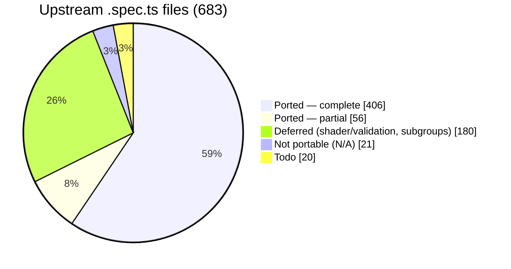
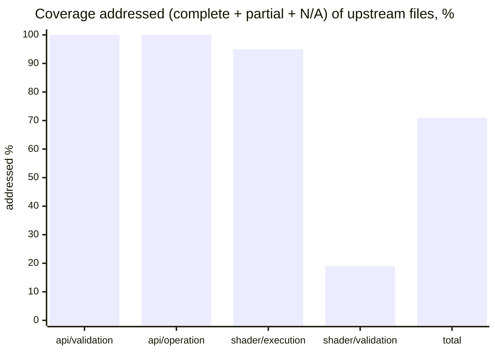

# webgpu-native-cts

A WebGPU Conformance Test Suite (CTS) written in **C++**, targeting the **WebGPU C API**
(`webgpu.h`) directly — no JavaScript engine, no language bindings.

> The *tests* are C++ that call the WebGPU **C** API. C++ is used because the upstream CTS is
> object-oriented, fluent, and closure-based; a C++ port maps to it almost 1:1, which is the
> whole point of a faithful port.

The goal is to port the upstream TypeScript [WebGPU CTS](https://github.com/gpuweb/cts)
as faithfully as practical, so that native WebGPU implementations can be checked for
conformance by linking a small native test binary instead of embedding a full JS runtime.

## Why

The canonical WebGPU CTS is written in TypeScript and runs in a browser or against native
implementations through a JS engine bound to native code:

- **wgpu** runs the CTS via Deno (`deno_webgpu` ops → `wgpu_core`).
- **Dawn** runs the CTS via Node.js NAPI bindings (`dawn_node` → `dawn::native`).

Both approaches require shipping and maintaining a JavaScript runtime and a binding layer.
This project takes a different path: the tests are written directly against the C API that
implementations such as [wgpu-native](https://github.com/gfx-rs/wgpu-native),
[yawgpu](https://github.com/infosia/yawgpu), and
[Dawn](https://dawn.googlesource.com/dawn) export, so the test binary links straight against
the implementation under test.

## Target implementations

Tests are written against the **canonical** `webgpu.h` from
[webgpu-native/webgpu-headers](https://github.com/webgpu-native/webgpu-headers), which all of the
target backends implement. The suite is **link-agnostic**: a build-time option (`CTS_BACKEND`)
selects which implementation to link against. Three backends are targeted, each playing a distinct
role in the cross-implementation comparison:

- **yawgpu** ([github.com/infosia/yawgpu](https://github.com/infosia/yawgpu)) — a from-scratch
  Rust implementation of `webgpu.h` (Metal/Vulkan backends; vendor extensions in a companion
  `yawgpu.h`). The **primary conformance subject** — the implementation this suite exists to validate.
- **Dawn** — Google's C++ reference implementation. It passes the ported suite, so it serves as the
  **conformance oracle**: the ground-truth behaviour against which any backend disagreement is judged.
- **wgpu-native** — the mature Rust implementation (`wgpu_core`); the backend the harness was first
  brought up against, and a third independent data point that keeps the comparison from being a
  two-way tie.

Implementation-specific differences (native feature enums, instance-creation extras like
yawgpu's `YaWGPUInstanceBackendSelect`) are isolated behind a thin backend shim.

## Language

- The entire suite — tests and harness — is **C++20**.
- Tests call the WebGPU **C** API (`webgpu.h`) directly; they do not depend on any C++ wrapper
  for WebGPU itself.
- The harness is a **custom C++ framework that mirrors the upstream CTS framework 1:1**
  (`MakeTestGroup` / `g.test().desc().params().fn()`, fluent parameter builders —
  `combine`/`combineWithParams`/`filter`/`expand`/`beginSubcases` with per-case subcase expansion —
  lambda test bodies, `expectValidationError([&]{ ... }, shouldError)`, the `suite:file:test:params`
  query system, and a case/subcase tree). It is **not** built on GoogleTest, Catch2, doctest, or
  Criterion — those impose a test model that conflicts with the CTS case/subcase split and
  query-string identity. The harness's own logic (params expansion, query parsing, format tables,
  expectation matching) is checked by a small self-test binary, `cts_unittests`, with no third-party
  test framework.

## Repository layout

```
webgpu-native-cts/
├── README.md  CLAUDE.md  LICENSE  CMakeLists.txt
├── docs/                  # Design docs + UPSTREAM / COVERAGE / FINDINGS
├── specs/                 # Per-slice task specs + reference/ (workflow, templates)
├── include/cts/           # Public C++ test-author API (gpu.h, test.h, webgpu.h)
├── src/
│   ├── common/            # Harness: registry, params, query, runner, runtime, webgpu/ (async→sync, backend shim)
│   ├── webgpu/            # Ported tests (.spec.cpp) + capability_info / texture_format tables + listing.json
│   └── unittests/         # Harness self-tests (cts_unittests)
├── expectations/          # Per-backend known-failure lists ({wgpu-native,yawgpu,dawn}.txt)
└── tools/gen_listings/    # Listing generator → src/webgpu/listing.json
```

The build directories (`build-*/`) are git-ignored. The canonical `webgpu.h` is **not** vendored —
each backend supplies its own `webgpu-headers/webgpu.h` (Dawn its generated header), selected by
`CTS_BACKEND` at configure time.

## Status

**Active.** The harness is complete; tests are being ported in parallel batches. All three
backends build link-agnostically and run on real GPUs — verified on **macOS / Apple Metal** and
**Windows 11 / Vulkan** (NVIDIA GeForce RTX 5060 Ti). Last full sweep: **2026-06-14** — Dawn `534184/0`,
yawgpu Metal green (`460730`, 2 Dawn-leniency now `xfail`), yawgpu MoltenVK Vulkan-path residuals,
wgpu-native bring-up. All eight Apple-masked native-Vulkan findings (F-105…F-112) resolved — seven
fixed & re-verified on NVIDIA Vulkan (2026-06-15/16), F-111 a documented external-texture `xfail`.
**Since (2026-06-18/19):** the `shader/execution` `expression/call/builtin` family advanced through five
batches — `atomics` (phaseY7), the **entire texture built-in family** (phaseY8–Y9, 15 files on a ported
`texture_utils` software-reference sampler), the P2 **synchronization + derivatives** built-ins (phaseY10:
`workgroupBarrier`/`storageBarrier`/`workgroupUniformLoad`/`arrayLength` + `dpdx`/`dpdy`/`fwidth`×coarse/fine),
the P3 **integer/bit/pack** built-ins (phaseY11: a generic `run()` expression harness + 16 integer/bit
builtins, `bitcast`, and 11 float pack/unpack), and the P3 **`expression/access/*`** tree (phaseY12:
vector/array/matrix/structure indexing, swizzle & member access via a composite-value layout extension to
`run()` — 5 files, Dawn + yawgpu Metal green, no new finding) — each verified green on Dawn + yawgpu Metal.
This surfaced
and resolved F-114 (naga `textureSampleGrad` 3D/cube gradient lowering), F-115 (yawgpu textureLoad combined
depth-stencil), F-116 (yawgpu `arrayLength` off-by-one on non-stride-multiple bindings), F-117
(`firstLeadingBit(u32)` all-ones), F-118 (`insertBits` const-eval), and F-119 (`pack2x16float`/
`unpack2x16float`), plus a yawgpu resource-retention leak fixed on the yawgpu side. The F-117/F-118 defects
are **confirmed upstream-naga** (wgpu-native fails them too, 2026-06-19 cross-check); F-119 was yawgpu-local.
**Then (2026-06-19) the `shader/validation` area opened** (phaseSV1, 40 files: extension/shader_io/decl/
functions/types/const_assert/uniformity) on a ported `ShaderValidationTest` enabler, run as a **3-backend
cross-check** (Dawn + yawgpu + wgpu-native) since yawgpu uses a naga fork. Result: **zero yawgpu-only
findings** — every yawgpu divergence is shared with wgpu-native (upstream-naga, F-120, which yawgpu will
fix in its naga fork). Separately, yawgpu **landed `shader-f16`**, which converted ~640 previously-skipped
f16 cases into runs and exposed **F-121** (f16 in access-indexing/swizzle + bitcast errored the pipeline —
const-eval dominant); **now fixed** (yawgpu `c937a32`/`a900cf8`) and re-verified green (`access,*` +
`bitcast` 0 fail; full `call,builtin,*` 702903 pass / 0 fail).
**Then (2026-06-20) phaseY13 completed the `shader/execution` P4 area** — a ported **FP-interval
acceptance framework** (f32 / f16 / abstract-float, faithful ULP/absolute/correctly-rounded intervals)
under all the math/trig builtins, plus every binary/unary operator, conversions, and constructors —
taking `shader/execution` to **226 / 239** (remaining 13 = optional `subgroups`, no Metal oracle). The
f32/f16/abstract **runtime** math is Dawn-equal on yawgpu; the only yawgpu non-passes are **const-eval**
(F-124 shared-naga abstract-float readback + the small yawgpu-only F-122/F-123/F-125). In parallel,
**F-120 was RESOLVED** in yawgpu's naga fork — structural WGSL validation **plus full graph uniformity
analysis** — taking `shader/validation` from 22781 yawgpu fails to **0** (a 462-file whole-suite Metal
sweep confirms: yawgpu `api/*` + `shader/validation` `fail=0`).

### Port coverage

683 upstream `.spec.ts` files at the [pinned revision](docs/UPSTREAM.md):



**The entire `api` surface is done** — all 201 `api/validation` + `api/operation` files are accounted for
(complete, partial, or classified N/A), with **zero remaining todo**. "Addressed" below = complete + partial
+ N/A (every upstream file resolved); the remainder is deferred (`shader/validation`, expression-precision
execution) or todo.



| Area | Addressed* | Note |
|------|----------:|------|
| `api/validation` | **129 / 129 ✅** | **fully ported** — every file complete (112), partial (14), or N/A (3); no todo (Y-6 V1–V10: capability_checks/features + all 35 limits) |
| `api/operation` | **72 / 72 ✅** | **fully ported** — every file complete (28), partial (42), or N/A (2); no todo. Partials leave some native-portable breadth deferred (vertical-first) |
| `shader/execution` | 226 / 239 | **essentially complete** — structural files + the entire `expression/call/builtin` family: `atomics`, the texture built-in family, sync/derivatives, integer/bit/pack, the **P4 math/trig builtins** on a ported **FP-interval acceptance framework** (f32 / f16 / abstract-float), all **binary/unary operators**, conversions, constructors, and `expression/access/*`. The 13 deferred are `subgroup*`/`quadBroadcast`/`quadSwap` (optional `subgroups` feature — Dawn-Metal skips, no oracle) + `texture_utils` (util, N/A) |
| `shader/validation` | 40 / 207 | `extension` (5), `shader_io` (14), `decl` (7), `functions` (2), `types` (10), `const_assert` (1), `uniformity` (1) — on a ported `ShaderValidationTest` enabler (`expectCompileResult`/`expectPipelineResult` + 3-backend cross-check). **Zero yawgpu-only findings**; all divergences were shared with wgpu-native (upstream-naga, **F-120 — now fixed in yawgpu's naga fork incl. full uniformity analysis**); rest (`expression`/`parse`/`statement` bulk) deferred |
| **Total** | **483 / 683** | + `web_platform`/`idl` N/A (16); `compat` + misc todo |

\* addressed = complete + partial + N/A (every upstream file resolved). Per-file detail and what each batch
added: [COVERAGE](docs/COVERAGE.md).

### What works

- **Harness, 1:1 with upstream** — registry, fluent params, the `suite:file:test:params` query
  system, fixtures, error scopes, async→sync helpers, listing generator, `cts_unittests` self-tests.
- **Crash containment** — `--isolate` runs each case in a child process (POSIX + Windows), so a
  backend *abort* becomes a contained `crash` result instead of killing the run.
- **Per-backend expectations** (`--expectations`) — runs with known divergences still exit 0,
  with nothing silently masked; `--workers N` shards a full sweep ~10× faster.

### Findings — 126 surfaced to date (F-001…F-126)

**Current state only** — the full per-finding record (what, which backend, root cause, fix history,
commit hashes) lives in [FINDINGS](docs/FINDINGS.md). Every divergence is reported and surfaced —
never masked to make a test pass. The headline: **yawgpu's implementation (`api/*` + `shader/execution`
runtime + the entire `shader/validation` frontend) is conformance-clean on native Metal**; the only open
yawgpu items are **3 small const-eval bugs** (F-122/F-123/F-125, ~20 cases) plus the **shared-naga
abstract-float const-eval** gap (F-124). The big naga-frontend block **F-120** (shader/validation
under-validation + full WGSL uniformity analysis, ~22781 cases) is **now RESOLVED in yawgpu's naga fork**.

| Bucket | # | Detail |
|--------|--:|--------|
| **yawgpu — open implementation defects** | **3** | **F-122** `<<` abstract-int const-eval, **F-123** `sub_neg` precedence const-eval, **F-125** `atanh` f32 const-eval — all **const-eval-only** (runtime passes), ~20 cases, yawgpu-only (Dawn + wgpu-native pass). Plus the 2-case Dawn-leniency `draw,index_buffer_format_dirtying` + F-111 external-texture, carried as `xfail` |
| **shared-naga — open** (yawgpu == wgpu-native) | **1** | **F-124** abstract-float const-eval readback (`frexp`/`ldexp`/`select` on abstract-float) — blocks the `abstract_float:const` variant of every FP builtin; yawgpu errors the pipeline, wgpu-native panics; Dawn passes. To be fixed in yawgpu's naga fork |
| yawgpu — fixed & hardware-re-verified | 94 | F-005…F-121 incl. **F-120** (shader/validation + graph uniformity analysis, 22781→0) and **F-121** (shader-f16); full list + commits in [FINDINGS](docs/FINDINGS.md) |
| Spec in flux / feature gap — **not a defect** | 2 | F-085 `sample_mask`/`position` per-sample semantics (gpuweb#5457, cts#4510 pending); F-111 `GPUExternalTexture` on the Vulkan backend — both `xfail` in the Vulkan-only expectation files |
| wgpu-native — open | 23+ | panics F-001–F-021 (contained via `--isolate`); F-015/F-027/F-028/F-036/F-045/F-048/F-052/F-056/F-084/F-088/F-097/F-113; plus upstream-naga shader/validation (no uniformity analysis) + shader-f16 unsupported (bring-up reference) |
| MoltenVK-only translation artifacts — green on native Metal + native Vulkan | 9 | F-104 `copyTextureToTexture` (14512, native-Vulkan-green), F-070 SPIRV-Cross residue, F-033, F-045, F-053/F-068 residuals, F-083, F-086, maxComputeWorkgroupStorageSize |

Buckets overlap where a finding affects several backends (e.g. F-045, F-082).

### Test results

#### Metal whole-suite sweep — **2026-06-20** (current, 462 files, `webgpu:*:*` `--workers 8`)

The current headline, refreshed after **phaseY13** (the entire P4 `expression` area — math/trig on an
FP-interval framework f32/f16/abstract, all operators/conversions/constructors) and the **F-120 fix**
(yawgpu naga-fork uniformity analysis). Whole-suite totals first; then **fails broken out by area** so
naga-lineage findings are not conflated with yawgpu's own implementation. Reported `fail` is the **real,
per-file-reproducible** count — whole-suite `adapter is "consumed"` / GPU-state-degradation collateral
(verified `fail=0` re-run alone) is excluded.

| Backend | Platform | pass | skip | fail (real) | crash | Verdict |
|---------|----------|-----:|-----:|-----:|------:|---------|
| **Dawn** (oracle) | Metal | 1522679 | 81880 | **0** | 0 | green (oracle). Raw whole-suite 2562 `fail` is all adapter-consumed collateral, excluded |
| **yawgpu** | Metal | 1264728 | 339376 | **558** | 0 | `api/*` **fail=0**, `shader/validation` **fail=0** (F-120 fixed). The 558 are all `shader/execution` const-eval — see area split. ~2443 api degradation collateral excluded |
| **wgpu-native** | Metal | 1003747 | 398626 | 37567 | 38550 | bring-up reference (panic-heavy, **not** triaged) — see area split. Contained via crash-resume |

**Fails by area** — where each backend's non-passes actually live:

| Backend | `api/*` | `shader/execution` | `shader/validation` |
|---------|---------|--------------------|---------------------|
| **yawgpu** | fail 0 (≈2443 degradation collateral, `fail=0` per-file) | **fail 558** — the **`abstract_float:const`** variant of FP builtins/operators (**F-124**, shared-naga abstract-float const-eval) + the 3 yawgpu-only const-eval bugs **F-122/F-123/F-125** (~18). f32/f16/abstract runtime math all green | **fail 0** — F-120 **RESOLVED** (structural validation + full graph uniformity analysis, 22781→0, yawgpu naga fork) |
| **wgpu-native** | degradation collateral | **crash ~31k + fail ~4k** — no `shader-f16` + unimplemented/abstract-float paths panic | **fail 23467** — upstream naga (no uniformity analysis) + broader under-validation; yawgpu's fork fixed this, upstream naga has not |

> **The split is the point:** yawgpu's `api/*` and `shader/validation` are now **fully green**; its only
> non-passes are **const-eval** in `shader/execution` — the shared-naga abstract-float readback (F-124,
> wgpu-native crashes the same cases) plus three small yawgpu-only const-eval bugs (F-122/F-123/F-125).
> The f32/f16/abstract **runtime** math is entirely green, confirming yawgpu's HAL math + the FP-interval
> framework agree with Dawn.

**Skips:** large because of legitimately **feature-unsupported** cases on yawgpu's Metal adapter — chiefly
`subgroups` (the `uniformity` subgroup g.tests alone skip ~133k) and `unrestricted_pointer_parameters`,
plus the `subgroup*`/`quad*` execution builtins (deferred, no Metal oracle). Dawn has these features so it
runs them. yawgpu's **`shader-f16` runs fully** (all f16 math/operators green, Dawn-equal).

#### MoltenVK whole-suite sweep — **2026-06-20** (current, 462 files, `CTS_YAWGPU_BACKEND=vulkan` + MoltenVK)

| Backend | Platform | pass | skip | fail (real) | crash | Verdict |
|---------|----------|-----:|-----:|-----:|------:|---------|
| **yawgpu** | Vulkan (MoltenVK) | 1249037 | 339376 | **16154** | 16 | Vulkan-path residuals — **no new yawgpu-core defects**, and `shader/validation` **fail=0** (F-120 fork fix applies to Vulkan too). Decomposes into: **F-104** `copyTextureToTexture` 14512 (MoltenVK-only translation artifact, native-Vulkan-green, fail=14512 in isolation); **F-070-family** SPIRV-Cross residue (`zero_init`/`robust_access_vertex`/`shader_io,fragment_builtins`, MoltenVK-only); + `shader/execution` const-eval (F-124/F-122/F-123/F-125, same as Metal). Raw whole-suite `fail=18692` also includes ~2538 degradation collateral (`fail=0` per-file) — excluded |

#### Native Vulkan / wgpu-native — **2026-06-14** (234-file snapshot, re-sweep pending)

These rows predate the phaseY7–Y13 + shader/validation work; a native-Vulkan (NVIDIA) re-sweep at the
grown 462-file listing is pending (needs the Windows/NVIDIA host, not this Mac).

| Backend | Platform | pass | skip | fail | crash | xfail | Verdict |
|---------|----------|-----:|-----:|-----:|------:|------:|---------|
| **yawgpu** | Vulkan (native, NVIDIA) | 402163 † | 183397 | **0** † | 0 | 94 | **green — every ported file `fail=0` in per-file isolation.** F-005…F-112 all fixed & native-Vulkan-re-verified (2026-06-15/16, incl. F-112 storage-buffer bounds policy); F-085 (92) + F-111 (2) = 94 `xfail`. † whole-suite via 48-shard batches: the raw run's ~12k `fail` is **stochastic GPU-state-degradation collateral** (each signature isolates `fail=0`), so the real fail is **0** and `pass` is a degradation-depressed lower bound |
| **wgpu-native** | Vulkan (`--isolate`, per-case) | 25668 | 10200 | 5680 | 6808 | — | bring-up reference (known panic-heavy state) |

- The **native Vulkan** and **MoltenVK** rows are now separated. yawgpu's **native Vulkan HAL passes the
  entire ported suite** (real `fail=0` by per-file isolation): every finding F-005…F-112 is fixed and
  native-Vulkan-re-verified, with F-085 (spec-in-flux) and F-111 (external-texture feature gap) carried as
  the 94 `xfail`. The whole-suite sharded run reports a large raw `fail`, but it is **stochastic
  GPU-state-degradation collateral** — at this suite size (~597k subcases) a single process accumulates
  resource pressure (`HAL queue submission failed` / `out of memory` / `shader compilation failed`), and
  every such signature returns `fail=0` when its file is re-run alone.
- yawgpu's **Metal HAL** passes all of `api/*`, **all of `shader/validation`** (F-120 RESOLVED — the naga
  fork now does full WGSL uniformity analysis, 22781→0), and the `shader/execution` **runtime** (f32/f16/
  abstract math + operators, all green; the 2 Dawn-leniency `draw,index_buffer_format_dirtying` cases are
  `xfail`). The only `shader/execution` non-passes are **const-eval** (558): the shared-naga abstract-float
  readback **F-124** + the three small yawgpu-only const-eval bugs **F-122/F-123/F-125**.
- The **MoltenVK** translation artifacts (F-104 `copyTextureToTexture` 14512 + the F-070-family SPIRV-Cross
  residue ~1032) are **not yawgpu defects** — each is green on native Metal *and* native Vulkan
  (F-104 native-Vulkan-confirmed green); MoltenVK/SPIRV-Cross mistranslates them. **Caveat (F-126):**
  `copyTextureToTexture` is **not** green on **native Vulkan / Mesa ANV Haswell** — multi-layer copies trigger
  a GPU-execution-time OOB DMA write there — but yawgpu is **exonerated** (its emitted `VkImageCopy` is
  verified in-bounds; the cause is ANV-Haswell, whose own driver warns "Haswell Vulkan support is incomplete").
  The rest of MoltenVK's
  `fail` is the same `shader/execution` const-eval set as Metal (F-124/F-122/F-123/F-125) plus whole-suite
  degradation collateral (`fail=0` per file); `shader/validation` is `fail=0` (F-120 fixed). See the
  [findings buckets](#findings--126-surfaced-to-date-f-001f-126) above.
- The native-Vulkan (NVIDIA) sweeps surfaced the genuine Apple-masked Vulkan-HAL/naga-path defects
  F-105/F-106, the F-107…F-110 batch, and F-112 (all fixed; per-finding detail in
  [FINDINGS](docs/FINDINGS.md)). Being Apple-masked, they never appeared in the Metal/MoltenVK rows.

#### wgpu-native — full suite, current scale (2026-06-14, native Vulkan)

A **whole-suite** Vulkan
run at the current listing (234 files, `--workers 8`) measures
`pass=289054 skip=215886 fail=9551 crash=7967 xfail=92` (raw). These are **not new defects** — they
are the wgpu-native panic + missing-validation families already recorded per area in
[COVERAGE](docs/COVERAGE.md) as *bring-up reference* (F-097 device-lost 2568; F-027/F-028 3D
copy/readback ≈3000; the F-092-area depth-readonly gaps 864; limits/alignment `unimplemented!()`
panics, contained as `crash` by `--workers` crash-resume). wgpu-native's
`expectations/wgpu-native-vulkan.txt` (8 lines) has **not yet been regenerated for the grown suite**,
so a full run is not triaged to `fail=0 crash=0` — regenerating
it via `--isolate --emit-crash-list` is pending. yawgpu remains the **primary** conformance subject;
wgpu-native is the bring-up reference.

Design and roadmap live in [`docs/`](docs/) — start with [`docs/00-overview.md`](docs/00-overview.md)
and [`docs/07-roadmap.md`](docs/07-roadmap.md).

## Documentation map

| Document | Contents |
|----------|----------|
| [00-overview](docs/00-overview.md) | Goals, non-goals, scope, key decisions |
| [01-architecture](docs/01-architecture.md) | Component architecture; TS-CTS → C mapping |
| [02-harness](docs/02-harness.md) | Registry, fixtures, params, query, tree, runner, listing |
| [03-webgpu-c-abstraction](docs/03-webgpu-c-abstraction.md) | Async→sync helpers, error scopes, backend shim |
| [04-authoring-tests](docs/04-authoring-tests.md) | Test-author API (C++) and worked example |
| [05-porting-guide](docs/05-porting-guide.md) | How to port a `.spec.ts` to a `.spec.cpp` |
| [06-build-and-run](docs/06-build-and-run.md) | CMake build, backend selection, running, filtering |
| [07-roadmap](docs/07-roadmap.md) | Phased milestones |
| [UPSTREAM](docs/UPSTREAM.md) | Pinned upstream CTS / header / backend revisions |
| [COVERAGE](docs/COVERAGE.md) | Per-area / per-file port status |
| [FINDINGS](docs/FINDINGS.md) | Per-backend conformance defects the suite surfaced |

## License

**BSD-3-Clause** (see [`LICENSE`](LICENSE)), matching the upstream CTS so that ported test logic —
a derivative work — stays license-compatible. Each ported file must preserve upstream attribution;
see [05-porting-guide §0](docs/05-porting-guide.md).
