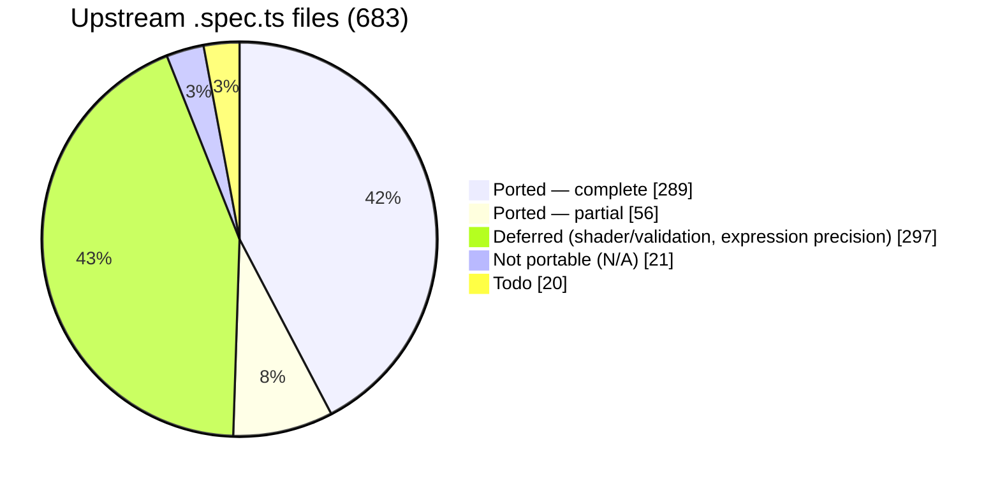
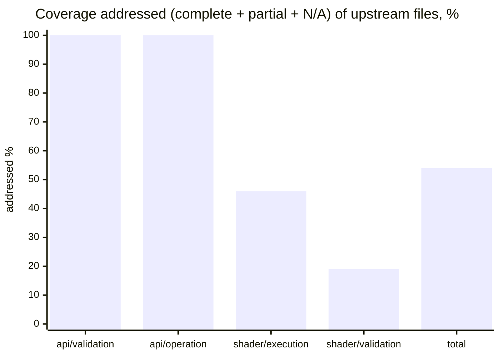

# webgpu-native-cts

A WebGPU Conformance Test Suite (CTS) written in **C++**, targeting the **WebGPU C API**
(`webgpu.h`) directly — no JavaScript engine, no language bindings.

> The *tests* are C++ that call the WebGPU **C** API. C++ is used because the upstream CTS is
> object-oriented, fluent, and closure-based; a C++ port maps to it almost 1:1, which is the
> whole point of a faithful port.

The goal is to port the upstream TypeScript [WebGPU CTS](https://github.com/gpuweb/cts)
as faithfully as practical, so that native WebGPU implementations can be checked for
conformance by linking a small native test binary instead of embedding a full JS runtime.

## Why

The canonical WebGPU CTS is written in TypeScript and runs in a browser or against native
implementations through a JS engine bound to native code:

- **wgpu** runs the CTS via Deno (`deno_webgpu` ops → `wgpu_core`).
- **Dawn** runs the CTS via Node.js NAPI bindings (`dawn_node` → `dawn::native`).

Both approaches require shipping and maintaining a JavaScript runtime and a binding layer.
This project takes a different path: the tests are written directly against the C API that
implementations such as [wgpu-native](https://github.com/gfx-rs/wgpu-native),
[yawgpu](https://github.com/infosia/yawgpu), and
[Dawn](https://dawn.googlesource.com/dawn) export, so the test binary links straight against
the implementation under test.

## Target implementations

Tests are written against the **canonical** `webgpu.h` from
[webgpu-native/webgpu-headers](https://github.com/webgpu-native/webgpu-headers), which all of the
target backends implement. The suite is **link-agnostic**: a build-time option (`CTS_BACKEND`)
selects which implementation to link against. Three backends are targeted, each playing a distinct
role in the cross-implementation comparison:

- **yawgpu** ([github.com/infosia/yawgpu](https://github.com/infosia/yawgpu)) — a from-scratch
  Rust implementation of `webgpu.h` (Metal/Vulkan backends; vendor extensions in a companion
  `yawgpu.h`). The **primary conformance subject** — the implementation this suite exists to validate.
- **Dawn** — Google's C++ reference implementation. It passes the ported suite, so it serves as the
  **conformance oracle**: the ground-truth behaviour against which any backend disagreement is judged.
- **wgpu-native** — the mature Rust implementation (`wgpu_core`); the backend the harness was first
  brought up against, and a third independent data point that keeps the comparison from being a
  two-way tie.

Implementation-specific differences (native feature enums, instance-creation extras like
yawgpu's `YaWGPUInstanceBackendSelect`) are isolated behind a thin backend shim.

## Language

- The entire suite — tests and harness — is **C++20**.
- Tests call the WebGPU **C** API (`webgpu.h`) directly; they do not depend on any C++ wrapper
  for WebGPU itself.
- The harness is a **custom C++ framework that mirrors the upstream CTS framework 1:1**
  (`MakeTestGroup` / `g.test().desc().params().fn()`, fluent parameter builders —
  `combine`/`combineWithParams`/`filter`/`expand`/`beginSubcases` with per-case subcase expansion —
  lambda test bodies, `expectValidationError([&]{ ... }, shouldError)`, the `suite:file:test:params`
  query system, and a case/subcase tree). It is **not** built on GoogleTest, Catch2, doctest, or
  Criterion — those impose a test model that conflicts with the CTS case/subcase split and
  query-string identity. The harness's own logic (params expansion, query parsing, format tables,
  expectation matching) is checked by a small self-test binary, `cts_unittests`, with no third-party
  test framework.

## Repository layout

```
webgpu-native-cts/
├── README.md  CLAUDE.md  LICENSE  CMakeLists.txt
├── docs/                  # Design docs + UPSTREAM / COVERAGE / FINDINGS
├── specs/                 # Per-slice task specs + reference/ (workflow, templates)
├── include/cts/           # Public C++ test-author API (gpu.h, test.h, webgpu.h)
├── src/
│   ├── common/            # Harness: registry, params, query, runner, runtime, webgpu/ (async→sync, backend shim)
│   ├── webgpu/            # Ported tests (.spec.cpp) + capability_info / texture_format tables + listing.json
│   └── unittests/         # Harness self-tests (cts_unittests)
├── expectations/          # Per-backend known-failure lists ({wgpu-native,yawgpu,dawn}.txt)
└── tools/gen_listings/    # Listing generator → src/webgpu/listing.json
```

The build directories (`build-*/`) are git-ignored. The canonical `webgpu.h` is **not** vendored —
each backend supplies its own `webgpu-headers/webgpu.h` (Dawn its generated header), selected by
`CTS_BACKEND` at configure time.

## Status

**Active.** The harness is complete; tests are being ported in parallel batches. All three
backends build link-agnostically and run on real GPUs — verified on **macOS / Apple Metal** and
**Windows 11 / Vulkan** (NVIDIA GeForce RTX 5060 Ti). Last full sweep: **2026-06-14** — Dawn `534184/0`,
yawgpu Metal green (`460730`, 2 Dawn-leniency now `xfail`), yawgpu MoltenVK Vulkan-path residuals,
wgpu-native bring-up. All eight Apple-masked native-Vulkan findings (F-105…F-112) resolved — seven
fixed & re-verified on NVIDIA Vulkan (2026-06-15/16), F-111 a documented external-texture `xfail`.
**Since (2026-06-18/19):** the `shader/execution` `expression/call/builtin` family advanced through five
batches — `atomics` (phaseY7), the **entire texture built-in family** (phaseY8–Y9, 15 files on a ported
`texture_utils` software-reference sampler), the P2 **synchronization + derivatives** built-ins (phaseY10:
`workgroupBarrier`/`storageBarrier`/`workgroupUniformLoad`/`arrayLength` + `dpdx`/`dpdy`/`fwidth`×coarse/fine),
the P3 **integer/bit/pack** built-ins (phaseY11: a generic `run()` expression harness + 16 integer/bit
builtins, `bitcast`, and 11 float pack/unpack), and the P3 **`expression/access/*`** tree (phaseY12:
vector/array/matrix/structure indexing, swizzle & member access via a composite-value layout extension to
`run()` — 5 files, Dawn + yawgpu Metal green, no new finding) — each verified green on Dawn + yawgpu Metal.
This surfaced
and resolved F-114 (naga `textureSampleGrad` 3D/cube gradient lowering), F-115 (yawgpu textureLoad combined
depth-stencil), F-116 (yawgpu `arrayLength` off-by-one on non-stride-multiple bindings), F-117
(`firstLeadingBit(u32)` all-ones), F-118 (`insertBits` const-eval), and F-119 (`pack2x16float`/
`unpack2x16float`), plus a yawgpu resource-retention leak fixed on the yawgpu side. The F-117/F-118 defects
are **confirmed upstream-naga** (wgpu-native fails them too, 2026-06-19 cross-check); F-119 was yawgpu-local.
**Then (2026-06-19) the `shader/validation` area opened** (phaseSV1, 40 files: extension/shader_io/decl/
functions/types/const_assert/uniformity) on a ported `ShaderValidationTest` enabler, run as a **3-backend
cross-check** (Dawn + yawgpu + wgpu-native) since yawgpu uses a naga fork. Result: **zero yawgpu-only
findings** — every yawgpu divergence is shared with wgpu-native (upstream-naga, F-120, which yawgpu will
fix in its naga fork). Separately, yawgpu **landed `shader-f16`**, which converted ~640 previously-skipped
f16 cases into runs and exposed **F-121** (f16 in access-indexing/swizzle + bitcast errored the pipeline —
const-eval dominant); **now fixed** (yawgpu `c937a32`/`a900cf8`) and re-verified green (`access,*` +
`bitcast` 0 fail; full `call,builtin,*` 702903 pass / 0 fail).

### Port coverage

683 upstream `.spec.ts` files at the [pinned revision](docs/UPSTREAM.md):



**The entire `api` surface is done** — all 201 `api/validation` + `api/operation` files are accounted for
(complete, partial, or classified N/A), with **zero remaining todo**. "Addressed" below = complete + partial
+ N/A (every upstream file resolved); the remainder is deferred (`shader/validation`, expression-precision
execution) or todo.



| Area | Addressed* | Note |
|------|----------:|------|
| `api/validation` | **129 / 129 ✅** | **fully ported** — every file complete (112), partial (14), or N/A (3); no todo (Y-6 V1–V10: capability_checks/features + all 35 limits) |
| `api/operation` | **72 / 72 ✅** | **fully ported** — every file complete (28), partial (42), or N/A (2); no todo. Partials leave some native-portable breadth deferred (vertical-first) |
| `shader/execution` | 109 / 239 | structural files (`flow_control`, `memory_model`, `statement`, `shader_io`) + `expression/call/builtin`: **`atomics` (11)**, the full **texture built-in family (15)**, P2 **sync/derivatives (13)** (`workgroupBarrier`/`storageBarrier`/`workgroupUniformLoad`/`arrayLength` + `dpdx`/`dpdy`/`fwidth`×coarse/fine), P3 **integer/bit/pack (28)** via a generic `run()` harness (16 int/bit + `bitcast` + 11 float pack/unpack), and **`expression/access/*` (5)** (vector/array/matrix/structure indexing & swizzle via a composite-value layout extension); rest (math/trig precision) deferred |
| `shader/validation` | 40 / 207 | `extension` (5), `shader_io` (14), `decl` (7), `functions` (2), `types` (10), `const_assert` (1), `uniformity` (1) — on a ported `ShaderValidationTest` enabler (`expectCompileResult`/`expectPipelineResult` + 3-backend cross-check). **Zero yawgpu-only findings** (all divergences shared with wgpu-native = upstream-naga, F-120); rest (`expression`/`parse`/`statement` bulk) deferred |
| **Total** | **366 / 683** | + `web_platform`/`idl` N/A (16); `compat` + misc todo |

\* addressed = complete + partial + N/A (every upstream file resolved). Per-file detail and what each batch
added: [COVERAGE](docs/COVERAGE.md).

### What works

- **Harness, 1:1 with upstream** — registry, fluent params, the `suite:file:test:params` query
  system, fixtures, error scopes, async→sync helpers, listing generator, `cts_unittests` self-tests.
- **Crash containment** — `--isolate` runs each case in a child process (POSIX + Windows), so a
  backend *abort* becomes a contained `crash` result instead of killing the run.
- **Per-backend expectations** (`--expectations`) — runs with known divergences still exit 0,
  with nothing silently masked; `--workers N` shards a full sweep ~10× faster.

### Findings — 121 surfaced to date (F-001…F-121)

**Current state only** — the full per-finding record (what, which backend, root cause, fix history,
commit hashes) lives in [FINDINGS](docs/FINDINGS.md). Every divergence is reported and surfaced —
never masked to make a test pass. The headline: **yawgpu has zero open implementation defects** on
native Metal *and* native Vulkan; the only open conformance gap left in the suite is **upstream-naga**
(`shader/validation` uniformity-analysis, F-120 — shared with wgpu-native, yawgpu-only = 0).

| Bucket | # | Detail |
|--------|--:|--------|
| **yawgpu — open implementation defects** | **0** | Passes the entire ported suite on native Metal AND native Vulkan. Non-passes are the 2-case Dawn-leniency `draw,index_buffer_format_dirtying` and F-111 external-texture — both `xfail`, not defects |
| **upstream-naga — open** (shared with wgpu-native) | **1** | **F-120** `shader/validation` uniformity-analysis (~22467 cases). yawgpu matches upstream naga; wgpu-native fails identically → yawgpu-only = 0. To be fixed in yawgpu's naga fork |
| yawgpu — fixed & hardware-re-verified | 92 | F-005…F-119 (full list + commits in [FINDINGS](docs/FINDINGS.md)) |
| Spec in flux / feature gap — **not a defect** | 2 | F-085 `sample_mask`/`position` per-sample semantics (gpuweb#5457, cts#4510 pending); F-111 `GPUExternalTexture` on the Vulkan backend — both `xfail` in the Vulkan-only expectation files |
| wgpu-native — open | 23 | panics F-001–F-021 (contained via `--isolate`); F-015/F-027/F-028/F-036/F-045/F-048/F-052/F-056/F-084/F-088/F-097/F-113 |
| MoltenVK-only translation artifacts — green on native Metal + native Vulkan | 9 | F-104 `copyTextureToTexture` (14512, native-Vulkan-green), F-070 SPIRV-Cross residue, F-033, F-045, F-053/F-068 residuals, F-083, F-086, maxComputeWorkgroupStorageSize |

Buckets overlap where a finding affects several backends (e.g. F-045, F-082).

### Test results

#### Metal whole-suite sweep — **2026-06-19** (current, 345 files, `webgpu:*:*` `--workers 8`)

The current headline, refreshed after the phaseY7–Y12 execution work, the `shader/validation` port
(40 files), and yawgpu's **`shader-f16`** landing. Whole-suite totals first; then **fails/crashes
broken out by area** (`api/*` vs `shader/execution` vs `shader/validation`) so naga-lineage defects
are not conflated with yawgpu's own implementation.

| Backend | Platform | pass | skip | fail | crash | Verdict |
|---------|----------|-----:|-----:|-----:|------:|---------|
| **Dawn** (oracle) | Metal | 1513210 | 81631 | **0** | 0 | green (oracle). Raw whole-suite 2441 `fail` is all `adapter is "consumed"` / GPU-state-degradation collateral that passes per-file — excluded |
| **yawgpu** | Metal | 1214197 | 357861 | **22467** | 0 | `api/*` + `shader/execution` **fail=0** (incl. f16); every fail is `shader/validation` — see area split. Whole-suite degradation collateral (~2443, `fail=0` per-file) excluded |
| **wgpu-native** | Metal | 997922 | 395185 | 37490 | 38054 | bring-up reference (panic-heavy, **not** triaged to `fail=0`) — see area split. Contained via crash-resume |

**Fails / crashes by area** — where each backend's non-passes actually live (the api vs shader split
that isolates naga):

| Backend | `api/*` | `shader/execution` | `shader/validation` |
|---------|---------|--------------------|---------------------|
| **yawgpu** | fail 0 · crash 0 | fail 0 · crash 0 (incl. f16) | **fail 22467** — all **upstream-naga** uniformity-analysis (F-120, yawgpu-only = 0). Structural slices (shader_io/decl/functions/types, ~314) **fixed in yawgpu's naga fork 2026-06-20**, `fail=0` |
| **wgpu-native** | api degradation collateral (`fail=0` per-file) | **crash 31026** — no `shader-f16` + unimplemented paths panic rather than skip | **fail 23467** — the F-120 shared-naga block **plus** broader wgpu-native-specific naga under-validation (e.g. `shader_io` 279 vs yawgpu's 34) |

> **The api vs shader split is the point:** yawgpu's implementation (`api/*` + `shader/execution`) is
> **fully green**; the 22467 yawgpu "fails" are entirely **naga frontend** (`shader/validation`), and
> wgpu-native — built on upstream naga — fails the same block, confirming it is a naga defect (F-120),
> not a yawgpu one.

**On the skips (and `shader-f16`):** yawgpu's **`shader-f16` now runs** — the ~310 previously-failing f16
execution cases (F-121) pass and the f16 cases that used to *skip* on yawgpu now execute (e.g. `access/*`
skip 664→12, `bitcast` skip 134→0). The skip total is nonetheless **larger** than the old 234-file
snapshot because the `shader/validation` port added a big block of **feature-gated skips that yawgpu's
Metal adapter genuinely lacks** — chiefly `subgroups` (the `uniformity` subgroup g.tests alone skip
~133k) and `unrestricted_pointer_parameters` (alias_analysis ~19k). Those are legitimate
"feature-unsupported" skips (Dawn has the features and runs them), not maskable and not defects.

#### MoltenVK whole-suite sweep — **2026-06-19** (current, 345 files, `CTS_YAWGPU_BACKEND=vulkan` + MoltenVK)

| Backend | Platform | pass | skip | fail | crash | Verdict |
|---------|----------|-----:|-----:|-----:|------:|---------|
| **yawgpu** | Vulkan (MoltenVK) | 1198558 | 357861 | **38325** | 0 | Vulkan-path residuals — **no new yawgpu-core defects**. Decomposes into: **F-120** shader/validation 22781 (upstream-naga, identical on Metal — shared frontend, not a MoltenVK artifact); **F-104** `copyTextureToTexture` 14512 (MoltenVK-only translation artifact, **native-Vulkan-green**, fail=14512 in isolation); **F-070-family** SPIRV-Cross residue ~1032 (`zero_init` 801 / `robust_access_vertex` 139 / `shader_io,fragment_builtins` 92, MoltenVK-only). Raw whole-suite `fail=40863` also includes ~2538 GPU-state-degradation collateral (`createBindGroupLayout` 1032, … **fail=0 re-run alone**) — excluded here. f16 now runs (skip matches Metal's 357861) |

#### Native Vulkan / wgpu-native — **2026-06-14** (234-file snapshot, re-sweep pending)

These rows predate the phaseY7–Y12 + shader/validation work; a native-Vulkan (NVIDIA) re-sweep at the
grown 345-file listing is pending (needs the Windows/NVIDIA host, not this Mac).

| Backend | Platform | pass | skip | fail | crash | xfail | Verdict |
|---------|----------|-----:|-----:|-----:|------:|------:|---------|
| **yawgpu** | Vulkan (native, NVIDIA) | 402163 † | 183397 | **0** † | 0 | 94 | **green — every ported file `fail=0` in per-file isolation.** F-005…F-112 all fixed & native-Vulkan-re-verified (2026-06-15/16, incl. F-112 storage-buffer bounds policy); F-085 (92) + F-111 (2) = 94 `xfail`. † whole-suite via 48-shard batches: the raw run's ~12k `fail` is **stochastic GPU-state-degradation collateral** (each signature isolates `fail=0`), so the real fail is **0** and `pass` is a degradation-depressed lower bound |
| **wgpu-native** | Vulkan (`--isolate`, per-case) | 25668 | 10200 | 5680 | 6808 | — | bring-up reference (known panic-heavy state) |

- The **native Vulkan** and **MoltenVK** rows are now separated. yawgpu's **native Vulkan HAL passes the
  entire ported suite** (real `fail=0` by per-file isolation): every finding F-005…F-112 is fixed and
  native-Vulkan-re-verified, with F-085 (spec-in-flux) and F-111 (external-texture feature gap) carried as
  the 94 `xfail`. The whole-suite sharded run reports a large raw `fail`, but it is **stochastic
  GPU-state-degradation collateral** — at this suite size (~597k subcases) a single process accumulates
  resource pressure (`HAL queue submission failed` / `out of memory` / `shader compilation failed`), and
  every such signature returns `fail=0` when its file is re-run alone.
- yawgpu's **Metal HAL** passes all of `api/*` and `shader/execution` (real `fail=0` per-file, incl. the
  now-running f16 cases; the 2 Dawn-leniency `draw,index_buffer_format_dirtying` cases are carried as
  `xfail` in `expectations/yawgpu.txt`). The remaining non-passes are in **`shader/validation`**: ~22467
  cases where yawgpu matches **upstream naga** (wgpu-native fails them identically — yawgpu-only = 0) but
  diverges from Dawn/Tint — the **uniformity-analysis** diagnostics (F-120, e.g. `uniformity:basics`
  ~21473). The **structural** `shader/validation` slices (shader_io/decl/functions/types, ~314) were
  **fixed in yawgpu's naga fork (2026-06-20)**; uniformity-analysis remains, a shared-naga work item.
- The **MoltenVK** translation artifacts (F-104 `copyTextureToTexture` 14512 + the F-070-family SPIRV-Cross
  residue ~1032) are **not yawgpu defects** — each is green on native Metal *and* native Vulkan
  (F-104 native-Vulkan-confirmed green); MoltenVK/SPIRV-Cross mistranslates them. The rest of MoltenVK's
  `fail=40863` is the shared-naga shader/validation block (F-120, identical on Metal) plus whole-suite
  degradation collateral (`fail=0` per file). See the [findings buckets](#findings--121-surfaced-to-date-f-001f-121) above.
- The native-Vulkan (NVIDIA) sweeps surfaced the genuine Apple-masked Vulkan-HAL/naga-path defects
  F-105/F-106, the F-107…F-110 batch, and F-112 (all fixed; per-finding detail in
  [FINDINGS](docs/FINDINGS.md)). Being Apple-masked, they never appeared in the Metal/MoltenVK rows.

#### wgpu-native — full suite, current scale (2026-06-14, native Vulkan)

A **whole-suite** Vulkan
run at the current listing (234 files, `--workers 8`) measures
`pass=289054 skip=215886 fail=9551 crash=7967 xfail=92` (raw). These are **not new defects** — they
are the wgpu-native panic + missing-validation families already recorded per area in
[COVERAGE](docs/COVERAGE.md) as *bring-up reference* (F-097 device-lost 2568; F-027/F-028 3D
copy/readback ≈3000; the F-092-area depth-readonly gaps 864; limits/alignment `unimplemented!()`
panics, contained as `crash` by `--workers` crash-resume). wgpu-native's
`expectations/wgpu-native-vulkan.txt` (8 lines) has **not yet been regenerated for the grown suite**,
so a full run is not triaged to `fail=0 crash=0` — regenerating
it via `--isolate --emit-crash-list` is pending. yawgpu remains the **primary** conformance subject;
wgpu-native is the bring-up reference.

Design and roadmap live in [`docs/`](docs/) — start with [`docs/00-overview.md`](docs/00-overview.md)
and [`docs/07-roadmap.md`](docs/07-roadmap.md).

## Documentation map

| Document | Contents |
|----------|----------|
| [00-overview](docs/00-overview.md) | Goals, non-goals, scope, key decisions |
| [01-architecture](docs/01-architecture.md) | Component architecture; TS-CTS → C mapping |
| [02-harness](docs/02-harness.md) | Registry, fixtures, params, query, tree, runner, listing |
| [03-webgpu-c-abstraction](docs/03-webgpu-c-abstraction.md) | Async→sync helpers, error scopes, backend shim |
| [04-authoring-tests](docs/04-authoring-tests.md) | Test-author API (C++) and worked example |
| [05-porting-guide](docs/05-porting-guide.md) | How to port a `.spec.ts` to a `.spec.cpp` |
| [06-build-and-run](docs/06-build-and-run.md) | CMake build, backend selection, running, filtering |
| [07-roadmap](docs/07-roadmap.md) | Phased milestones |
| [UPSTREAM](docs/UPSTREAM.md) | Pinned upstream CTS / header / backend revisions |
| [COVERAGE](docs/COVERAGE.md) | Per-area / per-file port status |
| [FINDINGS](docs/FINDINGS.md) | Per-backend conformance defects the suite surfaced |

## License

**BSD-3-Clause** (see [`LICENSE`](LICENSE)), matching the upstream CTS so that ported test logic —
a derivative work — stays license-compatible. Each ported file must preserve upstream attribution;
see [05-porting-guide §0](docs/05-porting-guide.md).
