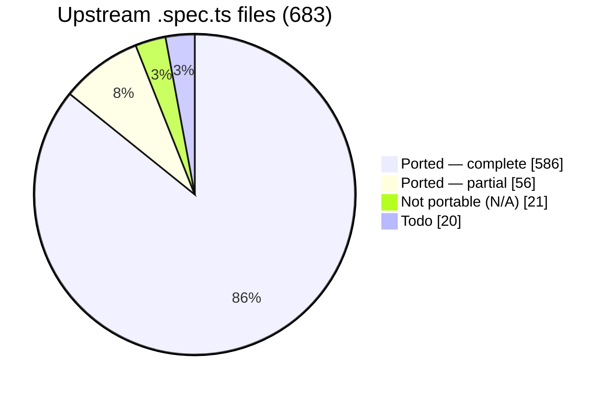

# webgpu-native-cts

A WebGPU Conformance Test Suite (CTS) written in **C++**, targeting the **WebGPU C API**
(`webgpu.h`) directly — no JavaScript engine, no language bindings.

> The *tests* are C++ that call the WebGPU **C** API. C++ is used because the upstream CTS is
> object-oriented, fluent, and closure-based; a C++ port maps to it almost 1:1, which is the
> whole point of a faithful port.

The goal is to port the upstream TypeScript [WebGPU CTS](https://github.com/gpuweb/cts)
as faithfully as practical, so that native WebGPU implementations can be checked for
conformance by linking a small native test binary instead of embedding a full JS runtime.

## Why

The canonical WebGPU CTS is written in TypeScript and runs in a browser or against native
implementations through a JS engine bound to native code:

- **wgpu** runs the CTS via Deno (`deno_webgpu` ops → `wgpu_core`).
- **Dawn** runs the CTS via Node.js NAPI bindings (`dawn_node` → `dawn::native`).

Both approaches require shipping and maintaining a JavaScript runtime and a binding layer.
This project takes a different path: the tests are written directly against the C API that
implementations such as [wgpu-native](https://github.com/gfx-rs/wgpu-native),
[yawgpu](https://github.com/infosia/yawgpu), and
[Dawn](https://dawn.googlesource.com/dawn) export, so the test binary links straight against
the implementation under test.

## Target implementations

Tests are written against the **canonical** `webgpu.h` from
[webgpu-native/webgpu-headers](https://github.com/webgpu-native/webgpu-headers), which all of the
target backends implement. The suite is **link-agnostic**: a build-time option (`CTS_BACKEND`)
selects which implementation to link against. Three backends are targeted, each playing a distinct
role in the cross-implementation comparison:

- **yawgpu** ([github.com/infosia/yawgpu](https://github.com/infosia/yawgpu)) — a from-scratch
  Rust implementation of `webgpu.h` (Metal/Vulkan backends). Its WGSL frontend is **Tint** — the same
  shader compiler Dawn uses — so its shader-compile, const-eval, and validation behaviour is
  byte-equivalent to the oracle. The **primary conformance subject**: this suite exists to validate it,
  and on native Metal it now passes the **entire** ported suite (`fail=0 crash=0`). Its vendor-extension
  surface (the companion `yawgpu.h`) is **not yet exercised** by the suite — only the canonical
  `webgpu.h` is tested today.
- **Dawn** — Google's C++ reference implementation. It passes the ported suite, so it serves as the
  **conformance oracle**: the ground-truth behaviour against which any backend disagreement is judged.
  Since yawgpu and Dawn now share the Tint frontend, they agree on shader compilation and validation.
- **wgpu-native** — the mature Rust implementation (`wgpu_core`), still on the **naga** WGSL frontend;
  the backend the harness was first brought up against, and a third independent data point. Being the
  one remaining naga-based backend, it is now where the naga-lineage shader findings (const-eval,
  frontend-validation, `discard`-derivative) still manifest after yawgpu moved to Tint.

Implementation-specific differences (native feature enums, instance-creation extras like
yawgpu's `YaWGPUInstanceBackendSelect` backend selector) are isolated behind a thin backend shim.

## Language

- The entire suite — tests and harness — is **C++20**.
- Tests call the WebGPU **C** API (`webgpu.h`) directly; they do not depend on any C++ wrapper
  for WebGPU itself.
- The harness is a **custom C++ framework that mirrors the upstream CTS framework 1:1**
  (`MakeTestGroup` / `g.test().desc().params().fn()`, fluent parameter builders —
  `combine`/`combineWithParams`/`filter`/`expand`/`beginSubcases` with per-case subcase expansion —
  lambda test bodies, `expectValidationError([&]{ ... }, shouldError)`, the `suite:file:test:params`
  query system, and a case/subcase tree). It is **not** built on GoogleTest, Catch2, doctest, or
  Criterion — those impose a test model that conflicts with the CTS case/subcase split and
  query-string identity. The harness's own logic (params expansion, query parsing, format tables,
  expectation matching) is checked by a small self-test binary, `cts_unittests`, with no third-party
  test framework.

## Repository layout

```
webgpu-native-cts/
├── README.md  CLAUDE.md  LICENSE  CMakeLists.txt
├── docs/                  # Design docs + UPSTREAM / COVERAGE / FINDINGS
├── specs/                 # Per-slice task specs + reference/ (workflow, templates)
├── include/cts/           # Public C++ test-author API (gpu.h, test.h, webgpu.h)
├── src/
│   ├── common/            # Harness: registry, params, query, runner, runtime, webgpu/ (async→sync, backend shim)
│   ├── webgpu/            # Ported tests (.spec.cpp) + capability_info / texture_format tables + listing.json
│   └── unittests/         # Harness self-tests (cts_unittests)
├── expectations/          # Per-backend known-failure lists ({wgpu-native,yawgpu,dawn}.txt)
└── tools/gen_listings/    # Listing generator → src/webgpu/listing.json
```

The build directories (`build-*/`) are git-ignored. The canonical `webgpu.h` is **not** vendored —
each backend supplies its own `webgpu-headers/webgpu.h` (Dawn its generated header), selected by
`CTS_BACKEND` at configure time.

## Status

**Active.** The harness is complete and all three backends build link-agnostically and run on real GPUs
(**macOS / Apple Metal** and **Windows 11 / Vulkan**, NVIDIA RTX 5060 Ti). **Every portable upstream area is
ported:** the entire **`api`** surface (`api/validation` + `api/operation`), **all of `shader/execution`**
(the FP-interval f32/f16/abstract math framework, the `subgroup*`/`quad*` execution builtins on a ported
`subgroup_util` engine, and the `texture_utils` meta-test), and **all of `shader/validation`**
(parse/statement/expression + the 114 builtin signature/type/const-overflow specs, on a ported
`ShaderValidationTest` enabler). The only unported upstream is `compat` (todo) and `web_platform`/`idl`
(N/A — no C-API surface). See [coverage](#port-coverage) below and [COVERAGE](docs/COVERAGE.md).

**Conformance (current).** yawgpu's WGSL frontend is now **Tint** (Dawn's shader compiler), replacing the
earlier naga frontend. With Tint, yawgpu's `shader/execution` and `shader/validation` behaviour is
byte-equivalent to the Dawn oracle, so **yawgpu passes the entire ported suite — `fail=0 crash=0` across
`api/*`, `shader/execution`, and `shader/validation` — on _both_ real-hardware paths: native macOS/Metal and
native Windows/Vulkan (NVIDIA RTX 5060 Ti).** On Metal this is 1,676,746 subcase passes with nothing masked;
on Vulkan the same, with a small set of known **non-defect** `xfail`s (spec-in-flux per-sample semantics,
GPU-divergent external-texture SPIR-V, an NVIDIA denormal/memory-model artifact that Dawn reproduces
identically on the same GPU). **yawgpu has zero open implementation defects.** Against the Dawn oracle the
only divergence anywhere is 48 `shader/validation` cases (**F-130**, a Dawn const-fold gap that yawgpu/Tint
get right), left unmasked. The naga-lineage findings (const-eval, `discard`-derivative, frontend-validation)
no longer manifest on yawgpu — they now appear only on **wgpu-native**, the one remaining naga-based backend
and a panic-heavy bring-up reference. Per-backend numbers: [Test results](#test-results); per-finding detail:
[FINDINGS](docs/FINDINGS.md).

### Port coverage

683 upstream `.spec.ts` files at the [pinned revision](docs/UPSTREAM.md):



**Every portable area is done** — all 201 `api/*` files and all 446 `shader/*` files (execution +
validation) are accounted for (complete, partial, or classified N/A), with **zero remaining todo** in those
areas. "Addressed" below = complete + partial + N/A (every upstream file resolved); the only remainder is
`compat` (todo) and `web_platform`/`idl` (N/A).

| Area | Addressed* | Note |
|------|----------:|------|
| `api/validation` | **129 / 129 ✅** | **fully ported** — every file complete (112), partial (14), or N/A (3); no todo (Y-6 V1–V10: capability_checks/features + all 35 limits) |
| `api/operation` | **72 / 72 ✅** | **fully ported** — every file complete (28), partial (42), or N/A (2); no todo. Partials leave some native-portable breadth deferred (vertical-first) |
| `shader/execution` | **239 / 239 ✅** | **fully ported** — structural files + the entire `expression/call/builtin` family: `atomics`, the texture built-in family, sync/derivatives, integer/bit/pack, the **P4 math/trig builtins** on a ported **FP-interval acceptance framework** (f32 / f16 / abstract-float), all **binary/unary operators**, conversions, constructors, `expression/access/*`, the `subgroup*`/`quadBroadcast`/`quadSwap` **execution** builtins (on a ported `subgroup_util` compute/fragment/accuracy engine), and the `texture_utils` meta-test. Dawn-oracle green (fail=0; subgroup-size gates honored — Dawn-Metal `subgroupMaxSize=32`); **yawgpu is `fail=0` here too** (Tint frontend, Dawn-equivalent) |
| `shader/validation` | **207 / 207 ✅** | **fully ported** — `extension`/`shader_io`/`decl`/`functions`/`types`/`const_assert`/`uniformity`, `parse`, `statement`, and `expression` (incl. all 114 builtin signature/type/const-overflow specs) on a ported `ShaderValidationTest` enabler (`expectCompileResult`/`expectPipelineResult`). **Dawn-oracle green** except 48 **F-130** divergences (`bitwise_shift:partial_eval_errors` lhs=const). On **yawgpu** this area is now `fail=0` (the **Tint** frontend matches Dawn); the naga-lineage validation gaps (**F-133**/**F-134**) remain only on wgpu-native |
| **Total** | **663 / 683** | + `web_platform`/`idl` N/A (16); `compat` + misc todo |

\* addressed = complete + partial + N/A (every upstream file resolved). Per-file detail and what each batch
added: [COVERAGE](docs/COVERAGE.md).

### What works

- **Harness, 1:1 with upstream** — registry, fluent params, the `suite:file:test:params` query
  system, fixtures, error scopes, async→sync helpers, listing generator, `cts_unittests` self-tests.
- **Crash containment** — `--isolate` runs each case in a child process (POSIX + Windows), so a
  backend *abort* becomes a contained `crash` result instead of killing the run.
- **Per-backend expectations** (`--expectations`) — runs with known divergences still exit 0,
  with nothing silently masked; `--workers N` shards a full sweep ~10× faster.

### Findings — 141 surfaced to date (F-001…F-141)

**Current state only** — the full per-finding record (what, which backend, root cause, fix history,
commit hashes) lives in [FINDINGS](docs/FINDINGS.md). Every divergence is reported and surfaced —
never masked to make a test pass. The headline: **yawgpu passes the entire ported suite on both native
Metal and native Vulkan (`fail=0 crash=0`) with zero open implementation defects.** Its WGSL frontend is
now **Tint** (shared with Dawn), so the naga-lineage shader findings — **F-124** (abstract-float
const-eval), **F-129** (`discard`+derivative SPIR-V), **F-133**/**F-134** (frontend-validation/const-eval),
**F-136** (`discard` encode) — are **resolved on yawgpu** and now manifest only on **wgpu-native** (still
naga). subgroup/quad execution correctly **skip** on yawgpu (no `subgroups` feature).

| Bucket | # | Detail |
|--------|--:|--------|
| **yawgpu — open implementation defects** | **0** | None. The entire ported suite is `fail=0 crash=0` on native Metal **and** native Vulkan (NVIDIA RTX 5060 Ti). The last two Vulkan defects — **F-127** (uniform-buffer robust reads not zeroed) and **F-138** (`bgra8unorm` `textureStore`) — were **resolved** (yawgpu `bd21cfb`). Only carried item is the 2-case Dawn-leniency `draw,index_buffer_format_dirtying`, where yawgpu is *stricter*, carried as `xfail` |
| **Resolved on yawgpu by the naga→Tint migration** | 5 | **F-124** (abstract-float / composite / f16-struct const-eval readback), **F-129** (`discard`+derivative `OpKill`-vs-demote-to-helper SPIR-V), **F-133** (naga WGSL-frontend validation/const-eval gaps vs tint), **F-134** (`non_zero:concrete_vector_mix` bool-vector const-eval crash), **F-136** (`discard:{three_quarters,function_call}` encode error). All naga-lineage; Tint compiles them correctly → `fail=0` on yawgpu. **Still present on wgpu-native** (naga) |
| yawgpu — fixed & hardware-re-verified | 100+ | the full Metal + Vulkan bring-up (F-005…F-138 implementation fixes), incl. **F-120** (uniformity analysis), **F-121** (shader-f16), **F-122**/**F-123**/**F-125** (const-eval/precedence), **F-127**/**F-138** (Vulkan robust-read / `bgra8unorm` store); full list in [FINDINGS](docs/FINDINGS.md) |
| Spec in flux / hardware / config — **not a defect (any backend)** | 4 | **F-085** `sample_mask`/`position` per-sample semantics (gpuweb#5457, cts#4510 pending); **F-111** `texture_external` on Vulkan (GPU-divergent multiplanar SPIR-V — deterministic clean rejection); **F-129 (denormal)** `fwidth` near `FLT_MIN` (CTS acceptance interval too tight — Dawn-Vulkan fails identically on the same GPU); **F-141** `memory_model,coherence:corr` atomic_storage (NVIDIA-HW weak behaviour — Dawn fails identically). All `xfail` in the Vulkan-only expectation file |
| **Dawn oracle — open** | 1 | **F-130** — Dawn skips the override shift-range check when the LHS const-folds to 0 (48 `shader/validation` cases). yawgpu/Tint get it right; left **unmasked** rather than added to `expectations/dawn.txt` |
| wgpu-native — open | 23+ | panics F-001–F-021 (contained via `--isolate`); F-015/F-027/F-028/F-036/F-052/F-056/F-084/F-088/F-097/F-113; **plus all the naga-lineage shader findings above** (F-124/F-129/F-133/F-134/F-136 — no uniformity analysis, naga const-eval gaps, shader-f16). Bring-up reference, not triaged to `fail=0` |
| MoltenVK-only translation artifacts — green on native Metal + native Vulkan | 9 | **F-104** `copyTextureToTexture` (14512, native-Vulkan-green), **F-139** depth-clip-clamp, **F-070** SPIRV-Cross residue, F-033, F-053/F-068 residuals, F-083, F-086, maxComputeWorkgroupStorageSize. Non-authoritative Vulkan coverage |
| CTS harness — resolved (not a backend defect) | 1 | **F-135** — the test runner now releases a fixture's acquired resources (devices) when a test **skips after acquisition**; previously these leaked and, on native Vulkan, exhausted the driver's concurrent-`VkDevice` limit in the `capability_checks,limits` suite. **Not a yawgpu defect** — its device lifecycle is correct |

Buckets overlap where a finding affects several backends (e.g. F-129/F-133 now on wgpu-native only).

### Test results

#### Per-area conformance — 642 files, by area

yawgpu numbers are the full ported sweep (`--workers 8`) on native **Metal** (macOS); they are byte-for-byte
the same on native **Vulkan** (Windows / NVIDIA RTX 5060 Ti) bar the documented non-defect `xfail`s. Any
remaining yawgpu/wgpu-native divergence is classified **naga-lineage** (now wgpu-native-only, since yawgpu
moved to Tint) per the 3-backend rule.

| Area | **Dawn** (oracle, Tint) | **yawgpu** (Metal + Vulkan, Tint) | **wgpu-native** (Metal, bring-up, naga)† |
|------|-------------------|--------------------|-----------------------------------|
| `api/validation` (129) | **fail 0** | **fail 0** (pass 450,926 with `api/operation`) | crash 6,857, fail 4,759 (panic-heavy bring-up) |
| `api/operation` (72) | **fail 0** | **fail 0** | crash 171, fail 208 |
| `shader/execution` (239) | **fail 0** | **fail 0, crash 0** (pass 725,445) — Tint frontend, Dawn-equivalent; `subgroup*`/`quad*` correctly **skip** (no `subgroups` feature) | crash 31,537, fail 198 — naga panics + const-eval (**F-124**-class, **F-134**) |
| `shader/validation` (207) | **fail 48** (**F-130**, `bitwise_shift:partial_eval_errors` lhs=const — a Dawn const-fold gap) | **fail 0, crash 0** (pass 500,375) — Tint frontend matches Dawn | crash 0, fail 1,693 (**F-133** naga frontend/const-eval gaps) |

† wgpu-native is panic-heavy, so its sweep runs under `--isolate` (per-**case** granularity, to contain the
process aborts); its counts (fresh Metal sweep 2026-06-28: total pass 154,932 / fail 6,858 / crash 38,565)
are **not** subcase-for-subcase comparable to the yawgpu/Dawn per-**subcase** columns. It is a bring-up
reference, not triaged to `fail=0`.

> **yawgpu now matches Dawn.** Because yawgpu and Dawn share the **Tint** WGSL frontend, yawgpu's
> `shader/execution` and `shader/validation` are byte-equivalent to the oracle — `fail=0` across the board,
> on both native Metal and native Vulkan. The naga-lineage divergences (const-eval, frontend-validation,
> `discard`-derivative — **F-124/F-133/F-134**) are now **wgpu-native-only** (it still uses naga). The CTS
> ports stay **faithful and Dawn-oracle green** (only 48 F-130 Dawn divergences, unmasked).

**Skips** (yawgpu) are large because of legitimately **feature-unsupported** cases on the adapter — chiefly
`subgroups` (the `uniformity` subgroup g.tests + the `subgroup*`/`quad*` execution builtins) and
`unrestricted_pointer_parameters`. Dawn exposes these so it runs them. yawgpu's **`shader-f16` runs fully**
(all f16 math/operators green, Dawn-equal), and the subgroup/quad **validation** specs run on Dawn-Metal.

_**Native Vulkan (Windows / NVIDIA RTX 5060 Ti) is confirmed green.** yawgpu passes the full ported suite on
native Vulkan with the same `fail=0 crash=0` as Metal, modulo a small set of documented **non-defect**
`xfail`s. yawgpu's last two native-Vulkan implementation defects — **F-127** (uniform-buffer robust reads not
zeroed) and **F-138** (`bgra8unorm` `textureStore`) — were **resolved** (yawgpu `bd21cfb`, 2026-06-28). The
remaining native-Vulkan `xfail`s are **not yawgpu defects**, each cross-checked against a **Dawn-Vulkan oracle
on the same GPU + API**: **F-085** per-sample `sample_mask`/`position` (spec-in-flux, gpuweb#5457), **F-111**
`texture_external` (GPU-divergent multiplanar SPIR-V — deterministic clean rejection), **F-129** denormal
`fwidth` (Dawn-Vulkan fails the byte-identical value — CTS acceptance interval too tight for the NVIDIA
denormal result), and **F-141** `memory_model,coherence:corr` atomic_storage (Dawn fails identically — an
NVIDIA-HW memory-model relaxation). MoltenVK-only artifacts (e.g. **F-139** depth-clip-clamp, **F-104**
`copyTextureToTexture`) are non-authoritative Vulkan coverage and green on native hardware. wgpu-native remains
a bring-up reference, not triaged to `fail=0`._

Design and roadmap live in [`docs/`](docs/) — start with [`docs/00-overview.md`](docs/00-overview.md)
and [`docs/07-roadmap.md`](docs/07-roadmap.md).

## Documentation map

| Document | Contents |
|----------|----------|
| [00-overview](docs/00-overview.md) | Goals, non-goals, scope, key decisions |
| [01-architecture](docs/01-architecture.md) | Component architecture; TS-CTS → C mapping |
| [02-harness](docs/02-harness.md) | Registry, fixtures, params, query, tree, runner, listing |
| [03-webgpu-c-abstraction](docs/03-webgpu-c-abstraction.md) | Async→sync helpers, error scopes, backend shim |
| [04-authoring-tests](docs/04-authoring-tests.md) | Test-author API (C++) and worked example |
| [05-porting-guide](docs/05-porting-guide.md) | How to port a `.spec.ts` to a `.spec.cpp` |
| [06-build-and-run](docs/06-build-and-run.md) | CMake build, backend selection, running, filtering |
| [07-roadmap](docs/07-roadmap.md) | Roadmap and remaining work |
| [UPSTREAM](docs/UPSTREAM.md) | Pinned upstream CTS / header / backend revisions |
| [COVERAGE](docs/COVERAGE.md) | Per-area / per-file port status |
| [FINDINGS](docs/FINDINGS.md) | Per-backend conformance defects the suite surfaced |

## License

**BSD-3-Clause** (see [`LICENSE`](LICENSE)), matching the upstream CTS so that ported test logic —
a derivative work — stays license-compatible. Each ported file must preserve upstream attribution;
see [05-porting-guide §0](docs/05-porting-guide.md).
