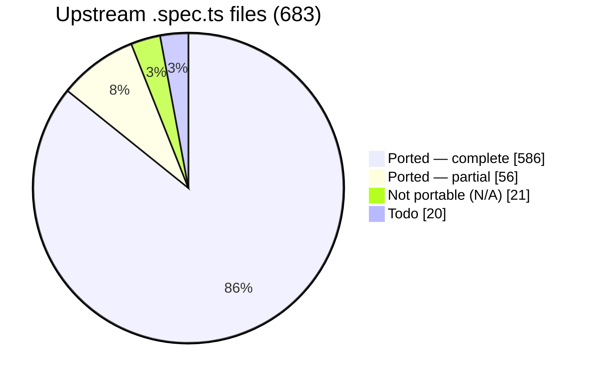

# webgpu-native-cts

A WebGPU Conformance Test Suite (CTS) written in **C++**, targeting the **WebGPU C API**
(`webgpu.h`) directly — no JavaScript engine, no language bindings.

> The *tests* are C++ that call the WebGPU **C** API. C++ is used because the upstream CTS is
> object-oriented, fluent, and closure-based; a C++ port maps to it almost 1:1, which is the
> whole point of a faithful port.

The goal is to port the upstream TypeScript [WebGPU CTS](https://github.com/gpuweb/cts)
as faithfully as practical, so that native WebGPU implementations can be checked for
conformance by linking a small native test binary instead of embedding a full JS runtime.

## Why

The canonical WebGPU CTS is written in TypeScript and runs in a browser or against native
implementations through a JS engine bound to native code:

- **wgpu** runs the CTS via Deno (`deno_webgpu` ops → `wgpu_core`).
- **Dawn** runs the CTS via Node.js NAPI bindings (`dawn_node` → `dawn::native`).

Both approaches require shipping and maintaining a JavaScript runtime and a binding layer.
This project takes a different path: the tests are written directly against the C API that
implementations such as [wgpu-native](https://github.com/gfx-rs/wgpu-native),
[yawgpu](https://github.com/infosia/yawgpu), and
[Dawn](https://dawn.googlesource.com/dawn) export, so the test binary links straight against
the implementation under test.

## Target implementations

Tests are written against the **canonical** `webgpu.h` from
[webgpu-native/webgpu-headers](https://github.com/webgpu-native/webgpu-headers), which all of the
target backends implement. The suite is **link-agnostic**: a build-time option (`CTS_BACKEND`)
selects which implementation to link against. Three backends are targeted, each playing a distinct
role in the cross-implementation comparison:

- **yawgpu** ([github.com/infosia/yawgpu](https://github.com/infosia/yawgpu)) — a from-scratch
  Rust implementation of `webgpu.h` (Metal/Vulkan backends; vendor extensions in a companion
  `yawgpu.h`). The **primary conformance subject** — the implementation this suite exists to validate.
- **Dawn** — Google's C++ reference implementation. It passes the ported suite, so it serves as the
  **conformance oracle**: the ground-truth behaviour against which any backend disagreement is judged.
- **wgpu-native** — the mature Rust implementation (`wgpu_core`); the backend the harness was first
  brought up against, and a third independent data point that keeps the comparison from being a
  two-way tie.

Implementation-specific differences (native feature enums, instance-creation extras like
yawgpu's `YaWGPUInstanceBackendSelect`) are isolated behind a thin backend shim.

## Language

- The entire suite — tests and harness — is **C++20**.
- Tests call the WebGPU **C** API (`webgpu.h`) directly; they do not depend on any C++ wrapper
  for WebGPU itself.
- The harness is a **custom C++ framework that mirrors the upstream CTS framework 1:1**
  (`MakeTestGroup` / `g.test().desc().params().fn()`, fluent parameter builders —
  `combine`/`combineWithParams`/`filter`/`expand`/`beginSubcases` with per-case subcase expansion —
  lambda test bodies, `expectValidationError([&]{ ... }, shouldError)`, the `suite:file:test:params`
  query system, and a case/subcase tree). It is **not** built on GoogleTest, Catch2, doctest, or
  Criterion — those impose a test model that conflicts with the CTS case/subcase split and
  query-string identity. The harness's own logic (params expansion, query parsing, format tables,
  expectation matching) is checked by a small self-test binary, `cts_unittests`, with no third-party
  test framework.

## Repository layout

```
webgpu-native-cts/
├── README.md  CLAUDE.md  LICENSE  CMakeLists.txt
├── docs/                  # Design docs + UPSTREAM / COVERAGE / FINDINGS
├── specs/                 # Per-slice task specs + reference/ (workflow, templates)
├── include/cts/           # Public C++ test-author API (gpu.h, test.h, webgpu.h)
├── src/
│   ├── common/            # Harness: registry, params, query, runner, runtime, webgpu/ (async→sync, backend shim)
│   ├── webgpu/            # Ported tests (.spec.cpp) + capability_info / texture_format tables + listing.json
│   └── unittests/         # Harness self-tests (cts_unittests)
├── expectations/          # Per-backend known-failure lists ({wgpu-native,yawgpu,dawn}.txt)
└── tools/gen_listings/    # Listing generator → src/webgpu/listing.json
```

The build directories (`build-*/`) are git-ignored. The canonical `webgpu.h` is **not** vendored —
each backend supplies its own `webgpu-headers/webgpu.h` (Dawn its generated header), selected by
`CTS_BACKEND` at configure time.

## Status

**Active.** The harness is complete and all three backends build link-agnostically and run on real GPUs
(**macOS / Apple Metal** and **Windows 11 / Vulkan**, NVIDIA RTX 5060 Ti). **Every portable upstream area is
ported:** the entire **`api`** surface (`api/validation` + `api/operation`), **all of `shader/execution`**
(the FP-interval f32/f16/abstract math framework, the `subgroup*`/`quad*` execution builtins on a ported
`subgroup_util` engine, and the `texture_utils` meta-test), and **all of `shader/validation`**
(parse/statement/expression + the 114 builtin signature/type/const-overflow specs, on a ported
`ShaderValidationTest` enabler). The only unported upstream is `compat` (todo) and `web_platform`/`idl`
(N/A — no C-API surface). See [coverage](#port-coverage) below and [COVERAGE](docs/COVERAGE.md).

**Conformance (current).** Against the **Dawn** oracle every ported test is green except 48
`shader/validation` cases (**F-130**, a Dawn const-fold gap). On **yawgpu** (Metal): `api/*` is `fail=0` and
the f32/f16/abstract **runtime** math matches Dawn; its one open implementation defect is **F-124**
(composite-result abstract-float const-eval, ~88 cases). The bulk of yawgpu's shader-frontend divergences
are **shared with wgpu-native** (upstream naga, **F-133**/**F-134**) — not yawgpu-specific. **wgpu-native**
is a panic-heavy bring-up reference. Per-backend numbers: [Test results](#test-results); per-finding detail:
[FINDINGS](docs/FINDINGS.md).

### Port coverage

683 upstream `.spec.ts` files at the [pinned revision](docs/UPSTREAM.md):



**Every portable area is done** — all 201 `api/*` files and all 446 `shader/*` files (execution +
validation) are accounted for (complete, partial, or classified N/A), with **zero remaining todo** in those
areas. "Addressed" below = complete + partial + N/A (every upstream file resolved); the only remainder is
`compat` (todo) and `web_platform`/`idl` (N/A).

| Area | Addressed* | Note |
|------|----------:|------|
| `api/validation` | **129 / 129 ✅** | **fully ported** — every file complete (112), partial (14), or N/A (3); no todo (Y-6 V1–V10: capability_checks/features + all 35 limits) |
| `api/operation` | **72 / 72 ✅** | **fully ported** — every file complete (28), partial (42), or N/A (2); no todo. Partials leave some native-portable breadth deferred (vertical-first) |
| `shader/execution` | **239 / 239 ✅** | **fully ported** — structural files + the entire `expression/call/builtin` family: `atomics`, the texture built-in family, sync/derivatives, integer/bit/pack, the **P4 math/trig builtins** on a ported **FP-interval acceptance framework** (f32 / f16 / abstract-float), all **binary/unary operators**, conversions, constructors, `expression/access/*`, the `subgroup*`/`quadBroadcast`/`quadSwap` **execution** builtins (on a ported `subgroup_util` compute/fragment/accuracy engine), and the `texture_utils` meta-test. Dawn-oracle green (fail=0; subgroup-size gates honored — Dawn-Metal `subgroupMaxSize=32`) |
| `shader/validation` | **207 / 207 ✅** | **fully ported** — `extension`/`shader_io`/`decl`/`functions`/`types`/`const_assert`/`uniformity`, `parse`, `statement`, and `expression` (incl. all 114 builtin signature/type/const-overflow specs) on a ported `ShaderValidationTest` enabler (`expectCompileResult`/`expectPipelineResult`). **Dawn-oracle green** except 48 **F-130** divergences (`bitwise_shift:partial_eval_errors` lhs=const). On yawgpu the validation fails are **shared upstream-naga** (yawgpu==wgpu-native, **F-133**/**F-134**); no yawgpu-specific frontend defect is open |
| **Total** | **663 / 683** | + `web_platform`/`idl` N/A (16); `compat` + misc todo |

\* addressed = complete + partial + N/A (every upstream file resolved). Per-file detail and what each batch
added: [COVERAGE](docs/COVERAGE.md).

### What works

- **Harness, 1:1 with upstream** — registry, fluent params, the `suite:file:test:params` query
  system, fixtures, error scopes, async→sync helpers, listing generator, `cts_unittests` self-tests.
- **Crash containment** — `--isolate` runs each case in a child process (POSIX + Windows), so a
  backend *abort* becomes a contained `crash` result instead of killing the run.
- **Per-backend expectations** (`--expectations`) — runs with known divergences still exit 0,
  with nothing silently masked; `--workers N` shards a full sweep ~10× faster.

### Findings — 134 surfaced to date (F-001…F-134)

**Current state only** — the full per-finding record (what, which backend, root cause, fix history,
commit hashes) lives in [FINDINGS](docs/FINDINGS.md). Every divergence is reported and surfaced —
never masked to make a test pass. The headline: **yawgpu's `api/*` and `shader/execution` runtime are
conformance-clean on native Metal**, and the `shader/validation` frontend is clean. yawgpu's **one** open
implementation defect is **F-124** — composite-result abstract-float const-eval readback (~88 cases). The
bulk (~77k `shader/validation` fails) are **shared upstream-naga** frontend/const-eval gaps (yawgpu ==
wgpu-native, both vs Dawn/tint; **F-133**/**F-134**), not yawgpu defects. subgroup/quad execution correctly
**skip** on yawgpu (no `subgroups` feature).

| Bucket | # | Detail |
|--------|--:|--------|
| **yawgpu — open implementation defects** | **1** | **F-124** abstract-float const-eval readback — **scalar/vector** path **fixed**; ~88 **composite-result** cases remain (`transpose`/`determinant`/`smoothstep` abstract_float + struct-returning `modf`/`frexp` for abstract & f16), Dawn-green. Plus the 2-case Dawn-leniency `draw,index_buffer_format_dirtying` + F-111, carried as `xfail` |
| upstream-naga (shared yawgpu + wgpu-native) — **not a yawgpu defect** | 2 | **F-133** — ~77k `shader/validation` fails **identical** on yawgpu and wgpu-native (both vs Dawn/tint): builtin const-eval "not implemented" (mix/faceForward/refract/…, same family as F-124), `@diagnostic(...)` directive unimplemented, binary/precedence/early-eval/statement/insertBits/texture-offset range checks. **F-134** — `non_zero:concrete_vector_mix` execution crash (yawgpu == wgpu-native). Upstream-naga frontend gaps; CTS ports stay faithful + Dawn-green |
| yawgpu — fixed & hardware-re-verified | 99 | incl. **F-120** (shader/validation + graph uniformity analysis), **F-121** (shader-f16), **F-122**/**F-123**/**F-125** (const-eval/precedence), **F-131** (`bitcast`-from-non-numeric), **F-132** (override-OOB array/matrix index); full list in [FINDINGS](docs/FINDINGS.md) |
| Spec in flux / feature gap — **not a defect** | 2 | F-085 `sample_mask`/`position` per-sample semantics (gpuweb#5457, cts#4510 pending); F-111 `GPUExternalTexture` on the Vulkan backend — both `xfail` in the Vulkan-only expectation files |
| wgpu-native — open | 23+ | panics F-001–F-021 (contained via `--isolate`); F-015/F-027/F-028/F-036/F-045/F-048/F-052/F-056/F-084/F-088/F-097/F-113; plus upstream-naga shader/validation (no uniformity analysis) + shader-f16 unsupported (bring-up reference) |
| MoltenVK-only translation artifacts — green on native Metal + native Vulkan | 9 | F-104 `copyTextureToTexture` (14512, native-Vulkan-green), F-070 SPIRV-Cross residue, F-033, F-045, F-053/F-068 residuals, F-083, F-086, maxComputeWorkgroupStorageSize |

Buckets overlap where a finding affects several backends (e.g. F-045, F-082).

### Test results

#### Per-area conformance (Metal, macOS) — 642 files, by area

Real fails **by area** (`--workers 8`), so naga-lineage divergences are not conflated with yawgpu's own
implementation. Each yawgpu/wgpu-native divergence is classified **yawgpu-only** (Dawn==wgpu-native pass,
yawgpu differs) vs **shared upstream-naga** (yawgpu==wgpu-native, both vs Dawn/tint) per the 3-backend rule.

| Area | **Dawn** (oracle) | **yawgpu** (Metal) | **wgpu-native** (Metal, bring-up) |
|------|-------------------|--------------------|-----------------------------------|
| `api/validation` (129) | **fail 0** | **fail 0** | panic-heavy bring-up (crash ≈6.9k, not triaged) |
| `api/operation` (72) | **fail 0** | **fail 0** | panic-heavy bring-up (crash ≈0.2k, not triaged) |
| `shader/execution` (239) | **fail 0** | **fail ~88** (F-124 composite abstract-float/f16 const-eval: transpose/determinant/smoothstep abstract + modf/frexp) **+ crash 16** (**F-134**, shared-naga `non_zero:concrete_vector_mix`). f32/f16/abstract **runtime** math all green; `subgroup*`/`quad*` correctly **skip** (no `subgroups` feature) | crash-heavy (panics) + F-124-class + F-134 |
| `shader/validation` (207) | **fail 48** (**F-130**, `bitwise_shift:partial_eval_errors` lhs=const — a Dawn const-fold gap) | **fail ~77476, crash 0** — all **F-133** (**shared upstream-naga**); no yawgpu-specific defect open | **fail 73737** (**F-133** shared upstream-naga) |

> **The split is the point.** yawgpu's `api/*` is **fully green** and its `shader/execution` **runtime** math
> (f32/f16/abstract) matches Dawn. The `shader/validation` divergences are **shared upstream-naga**
> (byte-identical on yawgpu and wgpu-native, both vs Dawn/tint — naga frontend/const-eval gaps, **F-133/F-134**),
> not yawgpu defects; no yawgpu-specific frontend defect is open. The CTS ports stay **faithful and
> Dawn-oracle green** (only 48 F-130 Dawn divergences, unmasked).

**Skips** (yawgpu) are large because of legitimately **feature-unsupported** cases on the Metal adapter —
chiefly `subgroups` (the `uniformity` subgroup g.tests + the `subgroup*`/`quad*` execution builtins) and
`unrestricted_pointer_parameters`. Dawn exposes these so it runs them. yawgpu's **`shader-f16` runs fully**
(all f16 math/operators green, Dawn-equal), and the subgroup/quad **validation** specs run on Dawn-Metal.

_Vulkan results (MoltenVK on macOS, native Vulkan on Windows/NVIDIA) are **pending a fresh sweep** against
the grown 642-file suite. The shared upstream-naga gaps (F-133/F-134) apply to the Vulkan path too (same
naga frontend) and will be re-measured there. wgpu-native remains a bring-up reference, not triaged to
`fail=0`._

Design and roadmap live in [`docs/`](docs/) — start with [`docs/00-overview.md`](docs/00-overview.md)
and [`docs/07-roadmap.md`](docs/07-roadmap.md).

## Documentation map

| Document | Contents |
|----------|----------|
| [00-overview](docs/00-overview.md) | Goals, non-goals, scope, key decisions |
| [01-architecture](docs/01-architecture.md) | Component architecture; TS-CTS → C mapping |
| [02-harness](docs/02-harness.md) | Registry, fixtures, params, query, tree, runner, listing |
| [03-webgpu-c-abstraction](docs/03-webgpu-c-abstraction.md) | Async→sync helpers, error scopes, backend shim |
| [04-authoring-tests](docs/04-authoring-tests.md) | Test-author API (C++) and worked example |
| [05-porting-guide](docs/05-porting-guide.md) | How to port a `.spec.ts` to a `.spec.cpp` |
| [06-build-and-run](docs/06-build-and-run.md) | CMake build, backend selection, running, filtering |
| [07-roadmap](docs/07-roadmap.md) | Roadmap and remaining work |
| [UPSTREAM](docs/UPSTREAM.md) | Pinned upstream CTS / header / backend revisions |
| [COVERAGE](docs/COVERAGE.md) | Per-area / per-file port status |
| [FINDINGS](docs/FINDINGS.md) | Per-backend conformance defects the suite surfaced |

## License

**BSD-3-Clause** (see [`LICENSE`](LICENSE)), matching the upstream CTS so that ported test logic —
a derivative work — stays license-compatible. Each ported file must preserve upstream attribution;
see [05-porting-guide §0](docs/05-porting-guide.md).
